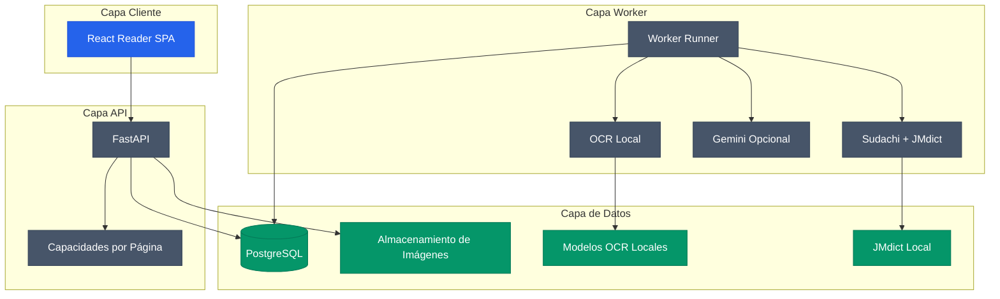

# MangaSensei

[](https://github.com/Gyliardson/mangasensei/releases)
[](LICENSE)
[](docs/versions.md)
[](docs/versions.md)

MangaSensei es un entorno local de estudio que extrae texto japonés de páginas
de manga, agrega datos lingüísticos deterministas y genera explicaciones
contextuales sin modificar la imagen original.

Documentación: [English](README.md) | [Português](README.pt-BR.md) |
[日本語](README.ja.md) | [Español](README.es.md)

La versión actual de desarrollo está registrada en [`VERSION`](VERSION). Los pesos
OCR y los datos derivados de JMdict se descargan localmente y no se incluyen en Git
ni en la imagen distribuible.

## Funciones

| Área | Capacidad |
| --- | --- |
| Carga | Subida segura de imágenes con idempotencia y capacidades HMAC por página |
| OCR | Subconjunto local de Manga Image Translator con modelos verificados por checksum |
| Lingüística | Sudachi y JMdict normalizado desde una fuente verificada |
| Gemini | Explicaciones estructuradas opcionales con presupuesto y `store=False` |
| Lector | SPA React con Blob autenticado, SVG responsivo, furigana y vocabulario |
| Operación | Cola PostgreSQL, leases, retención, readiness y métricas |

## Arquitectura



## Ejecución Local

```powershell
py -3.11 -m uv sync --extra ocr
npm install
Copy-Item .env.example .env
.\.venv\Scripts\mangasensei.exe models download
.\.venv\Scripts\mangasensei.exe jmdict download
docker compose up --build
```

Genera secretos y configúralos en `.env` antes de ejecutar cualquier cosa que use base de datos, cola o API: sustituye `POSTGRES_PASSWORD`, la contraseña dentro de `MANGASENSEI_DATABASE_URL` y el valor dentro de `MANGASENSEI_CAPABILITY_PEPPERS`:

```powershell
python -c "import secrets; print(secrets.token_urlsafe(32))"
```

## Rutas Principales

| Método | Ruta | Propósito |
| --- | --- | --- |
| `POST` | `/api/v1/pages` | Carga una página y crea un job |
| `GET` | `/api/v1/pages/{page_id}` | Consulta el resultado con token de página |
| `GET` | `/api/v1/pages/{page_id}/image` | Devuelve la imagen original autenticada |
| `POST` | `/api/v1/pages/{page_id}/reprocess` | Reprocesa la página con una capacidad dedicada |

## Artefactos Visuales

[](docs/assets/reader-desktop-chromium.png)

- [Captura del lector desktop](docs/assets/reader-desktop-chromium.png)
- [Captura del lector móvil](docs/assets/reader-mobile-chromium.png)

## Estructura

```text
backend/      API Python, worker, migraciones, OCR y lingüística
frontend/     SPA React y pruebas Playwright
docs/         Versiones y capturas visuales
tests/        Pruebas unitarias e integración del backend
var/          Datos locales ignorados por Git
```

## Contribución

Las contribuciones son bienvenidas. Lee [`CONTRIBUTING.md`](CONTRIBUTING.md) antes de
abrir una issue o un pull request y sigue el [`Código de Conducta`](CODE_OF_CONDUCT.md).
Para problemas de seguridad, usa el canal privado descrito en [`SECURITY.md`](SECURITY.md).

## Licencia

Copyright (C) 2026 Gyliardson Keitison. El código de MangaSensei usa GPL-3.0-only.
Los datos JMdict y los componentes de terceros conservan sus licencias y avisos en
[`THIRD_PARTY_NOTICES.md`](THIRD_PARTY_NOTICES.md).
