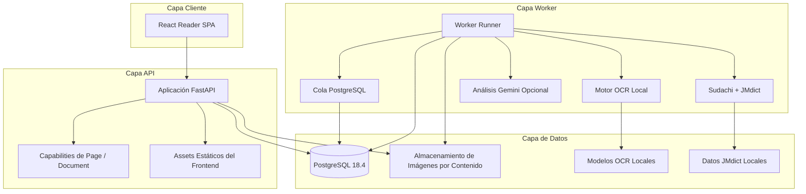

<div align="center">

# MangaSensei

**Lee manga. Entiende japonés. Mantén tus páginas en local.**

Un espacio local-first para estudiar japonés con manga mediante OCR, lingüística determinista, herramientas interactivas de lectura y explicaciones opcionales por IA.

**Estado: pre-release / desarrollo activo.** MangaSensei ya puede ejecutarse desde el código fuente, pero todavía no existe una Release pública estable en GitHub.

[English](README.md) · [Português](README.pt-BR.md) · [日本語](README.ja.md) · [Español](README.es.md)

[](https://github.com/Gyliardson/mangasensei/actions/workflows/ci.yml)
[](LICENSE)

</div>

<p align="center">
  <a href="docs/assets/reader-desktop-chromium.png"></a>
  <br>
  <sub>Vista previa actual del lector de una página. La captura reproducible dedicada y la presentación multipágina pertenecen a un workstream posterior.</sub>
</p>

MangaSensei preserva la página original y renderiza la información de estudio por separado. El OCR, la tokenización Sudachi y los datos revisados de JMdict se ejecutan localmente dentro de tu despliegue de MangaSensei. El enriquecimiento con Gemini es opcional y puede permanecer totalmente deshabilitado.

## ¿Por qué MangaSensei?

| Local-first | Imagen original preservada | Diseñado para estudiar |
| --- | --- | --- |
| El OCR y el análisis lingüístico fundamentales no dependen de un servicio de IA en la nube. | Las imágenes subidas permanecen sin modificar; las regiones OCR y los datos de estudio se mantienen aparte. | Furigana, vocabulario, preferencias de idioma, zoom/ajuste y contexto de estudio se organizan alrededor de la lectura. |

## Quick Start con Docker Compose

Este es el camino más corto soportado para visitantes. **No** requiere Python, Node.js ni `uv` instalados en el host; esas herramientas son requisitos de desarrollo, no del Quick Start con Docker.

### 1. Clona y crea la configuración local

Requisitos: Git, Docker y Docker Compose v2.

```sh
git clone https://github.com/Gyliardson/mangasensei.git
cd mangasensei
cp .env.example .env
```

En PowerShell:

```powershell
Copy-Item .env.example .env
```

Genera dos valores aleatorios independientes. El comando siguiente usa la misma imagen base de Python fijada por checksum que MangaSensei utiliza actualmente, de modo que Docker sigue siendo el único requisito de runtime para este paso:

```sh
docker run --rm python:3.11-slim-bookworm@sha256:d29f48a31a8b408ed19272ca1e7b10ebae13b240a27e862d3d4217c528e2e0c3 python -c "import secrets; print(secrets.token_urlsafe(32))"
```

Ejecútalo dos veces y edita `.env`:

- sustituye `POSTGRES_PASSWORD` por el primer valor;
- sustituye el valor dentro de `MANGASENSEI_CAPABILITY_PEPPERS=["..."]` por el segundo;
- deja `GOOGLE_API_KEY=` vacío para usar únicamente OCR y lingüística locales.

`MANGASENSEI_DATABASE_URL` en `.env.example` es para desarrollo ejecutado directamente en el host. Docker Compose proporciona su propia URL interna de base de datos a los contenedores, por lo que ese campo no necesita modificarse para este Quick Start.

No reutilices los placeholders del repositorio ni hagas commit de tu `.env`.

### 2. Construye e inicia MangaSensei

```sh
docker compose up --detach --build
```

En una instalación limpia, este comando construye la aplicación y ejecuta servicios one-shot para migraciones, modelos OCR fijados por checksum y datos JMdict revisados en inglés/alemán antes de que el worker quede listo. **El primer bootstrap necesita acceso a la red** para obtener capas de contenedores, artefactos de modelos OCR y datos fuente de JMdict. Después, esos artefactos quedan en volúmenes Docker locales para el procesamiento local posterior.

Gemini permanece deshabilitado mientras `GOOGLE_API_KEY` esté vacío. El OCR japonés, el análisis Sudachi y el vocabulario determinista de JMdict siguen funcionando; los campos de traducción/explicación contextual por IA pueden estar ausentes.

### 3. Comprueba readiness y abre el lector

```sh
docker compose ps --all
curl --fail http://127.0.0.1:8000/ready
```

En PowerShell:

```powershell
Invoke-RestMethod http://127.0.0.1:8000/ready
```

Después abre **http://127.0.0.1:8000** y analiza una fuente JPEG, PNG, WebP o un PDF. Varias imágenes conservan el orden elegido; un PDF pasa primero por un render/import local acotado y después usa el mismo Document temporal y ordenado.

Si el bootstrap falla:

```sh
docker compose logs models jmdict migrate api pdf-renderer pdf-importer worker
```

### 4. Detén o limpia el entorno

Detén los contenedores conservando los volúmenes locales de base de datos/modelos/diccionario:

```sh
docker compose down
```

Elimina también los volúmenes Docker locales de MangaSensei:

```sh
docker compose down --volumes --remove-orphans
```

El segundo comando elimina el estado local de la base de datos, el almacenamiento de páginas subidas, los modelos OCR y los datos JMdict; el siguiente inicio limpio tendrá que repetir los downloads de bootstrap.

## Flujo principal

Una sesión normal de lectura es intencionadamente sencilla:

1. Selecciona una imagen compatible, un conjunto ordenado de imágenes o un PDF.
2. MangaSensei preserva la imagen original y encola cada Page para OCR local y análisis lingüístico.
3. Abre Pages completadas en el lector responsivo mientras los overlays de estudio permanecen separados de la imagen fuente.
4. Selecciona regiones OCR para inspeccionar texto japonés, furigana, tokens y vocabulario determinista del diccionario.
5. Opcionalmente habilita Gemini para enriquecimiento contextual en el idioma de estudio.

El lector actual también es responsivo en móvil:

<p align="center">
  <a href="docs/assets/reader-mobile-chromium.png"></a>
  <br>
  <sub>Vista previa actual del lector móvil.</sub>
</p>

## Flujo multipágina

Los Slices B, C y D de [#105](https://github.com/Gyliardson/mangasensei/issues/105) admiten Documents de múltiples imágenes ordenadas, resultados parciales/recuperación e importación PDF local endurecida sin convertir un volumen entero en un único job gigante de OCR.

**Disponible ahora:**

- seleccionar varias imágenes JPEG, PNG o WebP e inspeccionarlas/reordenarlas antes de subirlas;
- seleccionar un PDF para una etapa asíncrona, local y acotada de render/import; todos los raster se validan antes de confirmar el Document normal;
- seleccionar un PDF para una etapa asíncrona, local y acotada de render/import; todos los raster se validan antes de confirmar el Document normal;
- seleccionar un PDF para una etapa asíncrona, local y acotada de render/import; todos los raster se validan antes de confirmar el Document normal;
- conservar el orden mostrado antes de la carga como orden inicial canónico del Document;
- mantener cada Page como unidad independiente de OCR/estudio/job;
- mostrar estados agregados veraces de procesando, completado, completado con errores y cancelado, junto con contadores de Pages completadas / en proceso / con fallo / canceladas;
- mantener legibles las Pages completadas mientras trabajo hermano o posterior sigue procesándose, falla o se cancela;
- reintentar Pages fallidas sin resultado legible mediante una operación de Document acotada/idempotente sin recomputar hermanas exitosas;
- cancelar cooperativamente el procesamiento activo del Document sin reescribir Pages ya completadas;
- persistir el orden de Pages después de la creación con concurrencia optimista;
- navegar mediante selección directa y controles Anterior / Siguiente;
- reprocesar idioma de estudio o idioma de diccionario solo para la Page actual;
- mantener el Document y todas las Pages hijas en el mismo límite exacto de retención de 24 horas.

**Aún aplazado en #105:** thumbnails, biblioteca persistente de manga, semántica de orden de lectura consciente de spreads/entre páginas y hardening posterior de rendimiento/escala para Documents grandes.

Consulta el [contrato de Documents multiimagen](docs/document-imports.md) para límites, capabilities, idempotencia, retención, recuperación y semántica de fallos.

## Validación actual

### Evidencia de OCR y calidad de producto

MangaSensei **no** publica actualmente un porcentaje universal de precisión OCR. Los recuentos de tests de CI y la cobertura de código son garantías de ingeniería, no medidas de precisión OCR.

La evidencia OCR actual incluye:

- regresiones sintéticas deterministas y un smoke de compatibilidad con modelos reales en CPU;
- un **corpus de presión de 12 páginas de manga real licenciado**, verificado por checksum y con procedencia/reglas de uso documentadas;
- anclas revisadas en páginas reales para recall de texto vertical corto, regresiones de contexto/reconocedor y un guard específico de precisión contra textura gráfica;
- un estudio controlado de compatibilidad OpenCV 4→5 sobre el corpus revisado que encontró drift limitado de píxeles en el warp del reconocedor sin cambios en el texto aceptado/final, geometría final, orden de lectura ni casos de presión revisados.

El corpus de 12 páginas deliberadamente **no** tiene ground truth exhaustivo de transcripción para todas las páginas. Las páginas más amplias usan contratos de regresión/caracterización en vez de una verdad completa inventada; por ello MangaSensei no deriva de ese dataset un CER global, precision/recall de detección ni afirmaciones como "99% de precisión".

Las limitaciones OCR conocidas siguen registradas, entre ellas geometría de bōten/marcas de énfasis separadas ([#93](https://github.com/Gyliardson/mangasensei/issues/93)), sustituciones de glifos similares con alta confianza ([#99](https://github.com/Gyliardson/mangasensei/issues/99)) y una clase de falso positivo gráfico/símbolo con alta confianza ([#100](https://github.com/Gyliardson/mangasensei/issues/100)).

Consulta la [estrategia de pruebas](docs/testing.md) y el [contrato del corpus licenciado](tests/fixtures/ocr/real_manga/black_jack/README.md) para los límites exactos de estas garantías.

### Garantía de ingeniería

El CI normal valida por separado lint/tipos/tests del backend con cobertura, lint/typecheck/tests unitarios/cobertura/build del frontend, Playwright simulado para desktop/mobile/accesibilidad, un flujo full-stack real navegador → FastAPI → PostgreSQL con las fronteras externas OCR/Gemini sustituidas deterministicamente, build/runtime Docker de producción, wheel/sdist con instalación limpia y comprobaciones de seguridad de secretos/dependencias. CodeQL se ejecuta por separado y el workflow de contrato JMdict verifica la integridad source→runtime del diccionario además del bootstrap/readiness de Compose en estado limpio.

Estos gates se describen en [docs/testing.md](docs/testing.md) y se implementan en [`.github/workflows/`](.github/workflows/).

## Privacidad y límites local-first

- Las imágenes originales de manga permanecen dentro de tu despliegue de MangaSensei y nunca se envían a Gemini.
- El OCR se ejecuta localmente con artefactos de modelo verificados por checksum.
- La tokenización Sudachi y los datos revisados de JMdict son locales.
- Gemini es opcional. Cuando se habilita, el contrato actual envía texto OCR y candidatos léxicos mínimos por región (`id`, `surface`, `lemma`, `reading`) para enriquecimiento contextual; no envía la imagen original, el dataset JMdict ni los significados deterministas del diccionario, y las solicitudes usan `store=False`.
- El acceso a Pages y Documents usa capability tokens con alcance en vez de tratar un UUID de recurso como autorización.
- Los datos de Page/Document siguen el contrato actual de retención exacta de 24 horas; leer o reproyectar idiomas no amplía ese plazo.

"Local-first" describe los límites de procesamiento y datos una vez disponibles los artefactos necesarios. Un bootstrap Docker nuevo puede necesitar red para descargar modelos fijados, fuentes del diccionario y capas de contenedores; Gemini opcional requiere acceso al proveedor cuando está habilitado.

Consulta [SECURITY.es.md](SECURITY.es.md), [docs/document-imports.md](docs/document-imports.md) y [docs/testing.md](docs/testing.md) para contratos más profundos.

## Idiomas y funciones de estudio

Cuatro ejes de idioma son deliberadamente independientes:

| Eje | Soporte actual |
| --- | --- |
| Contenido del manga | Japonés (`ja`) |
| Estudio / explicación contextual | Portugués de Brasil (`pt-BR`) o Inglés (`en`) |
| Idioma solicitado del diccionario determinista | Inglés (`en`), Alemán (`de`) o Portugués de Brasil (`pt-BR`) |
| Locale de interfaz | Inglés (`en`) o Portugués de Brasil (`pt-BR`) |

El alemán usa el pack JMdict local revisado cuando está disponible la forma canónica exacta y hace fallback por elemento a inglés en los demás casos. Una solicitud de diccionario `pt-BR` sigue marcada explícitamente como Portugués de Brasil, pero los significados deterministas de palabras usan actualmente fallback a inglés porque no existe un pack revisado de glosas JMdict portuguesas a nivel de palabra. Cambiar el idioma del diccionario reutiliza el análisis lingüístico canónico persistido y no vuelve a ejecutar OCR, adquisición léxica de Sudachi ni Gemini.

Consulta el [contrato de ejes de idioma](docs/study-languages.md) y el [contrato de packs JMdict](docs/jmdict-packs.md).

## Funciones

| Área | Capacidad |
| --- | --- |
| Carga | Imágenes standalone seguras, Documents multiimagen ordenados/acotados e importación PDF local endurecida con idempotencia y capabilities con alcance |
| OCR | Subconjunto local de Manga Image Translator con modelos verificados por checksum |
| Lingüística | Tokenización Sudachi y datos JMdict locales revisados en inglés/alemán sobre identidades léxicas canónicas independientes del idioma |
| Lector | Renderizado Blob autenticado de la imagen original, overlays SVG responsivos, furigana, zoom/ajuste, navegación multipágina y lectura de resultados parciales |
| Idiomas | Preferencias independientes de UI, estudio/explicación y diccionario solicitado, con fallback presentado explícitamente |
| Gemini | Explicaciones contextuales estructuradas opcionales en `pt-BR`/`en`, control de presupuesto, contexto textual mínimo y `store=False` |
| Operación | Cola PostgreSQL, recuperación por leases, retención acotada, readiness, métricas y runtime Compose endurecido |

## Limitaciones conocidas y alcance pre-release

MangaSensei sigue siendo software pre-release. Además de las limitaciones OCR indicadas arriba:

- los Documents son temporales, no una biblioteca persistente de manga;
- thumbnails y orden de lectura consciente de spreads/entre páginas no están implementados;
- el hardening posterior de rendimiento/escala para Documents grandes sigue aplazado en #105;
- los capability tokens de Document solo se mantienen en la sesión activa de la página del navegador, por lo que un reload pierde el acceso en vez de persistir de forma insegura un token sensible;
- la salida contextual de Gemini es enriquecimiento opcional y no se necesita para estudiar localmente con OCR/JMdict.

La versión actual de desarrollo se registra en [`VERSION`](VERSION). Sigue [issues](https://github.com/Gyliardson/mangasensei/issues) para roadmap y defectos conocidos.

## Arquitectura



El stack Compose de producción ejecuta PostgreSQL, servicios one-shot de bootstrap de modelos/JMdict/migraciones, el servicio FastAPI/frontend, worker y retención con capabilities Linux eliminadas, `no-new-privileges`, ejecución non-root de la aplicación y filesystem de aplicación read-only donde corresponde.

## Calidad de ingeniería y desarrollo

### Toolchain de desarrollo

El Quick Start Docker anterior es el camino para visitantes. El desarrollo directo en el host usa además las versiones revisadas en [docs/versions.md](docs/versions.md), incluidos Python 3.11, Node.js 24 LTS como objetivo (`22.12+` soportado por el tooling actual) y `uv`.

Comandos típicos de dependencias/bootstrap:

```sh
uv sync --extra ocr
npm install
uv run mangasensei models download
uv run mangasensei models verify
uv run mangasensei jmdict download
uv run mangasensei jmdict download --language de
```

Para ejecución directa en el host, crea `.env` desde `.env.example` y sigue sus comentarios para que la URL de base de datos del host use la misma contraseña generada. Docker Compose sigue siendo la ruta soportada más simple para ejecutar el stack completo.

<details>
<summary>Quality gates locales</summary>

```sh
uv run python scripts/version.py check
uv run python scripts/check_markdown_links.py
uv run ruff check backend/src tests scripts
uv run mypy backend/src
uv run pytest --cov
npm run lint
npm run typecheck
npm run test:coverage
npm run build
npm run e2e
```

Las garantías más pesadas de OCR, Compose limpio, CodeQL y release/distribución se documentan en [docs/testing.md](docs/testing.md).

</details>

### Contribución y actividad del proyecto

Las contribuciones son bienvenidas en **English, Português, 日本語 o Español**.

[Guía de contribución](CONTRIBUTING.es.md) · [Código de Conducta](CODE_OF_CONDUCT.es.md) · [Política de Seguridad](SECURITY.es.md) · [Issues](https://github.com/Gyliardson/mangasensei/issues) · [Discussions](https://github.com/Gyliardson/mangasensei/discussions) · [Colaboradores](https://github.com/Gyliardson/mangasensei/graphs/contributors)

## API y documentación detallada

FastAPI sirve documentación interactiva de la API en `/api/docs` cuando MangaSensei está en ejecución. Los recursos Page/Document siguen protegidos por capabilities.

<details>
<summary>Superficie principal de la API</summary>

| Método | Ruta | Propósito |
| --- | --- | --- |
| `POST` | `/api/v1/pages` | Sube una página japonesa y encola análisis |
| `GET` | `/api/v1/pages/{page_id}` | Lee una Page standalone con su capability de lectura |
| `GET` | `/api/v1/pages/{page_id}/image` | Devuelve la imagen original standalone protegida |
| `POST` | `/api/v1/pages/{page_id}/reprocess` | Reprocesa un eje de idioma standalone |
| `POST` | `/api/v1/documents` | Crea un Document multiimagen ordenado |
| `GET` | `/api/v1/documents/{document_id}` | Lee hijos ordenados, estado agregado y progreso |
| `GET` | `/api/v1/documents/{document_id}/progress` | Lee contadores completados/en proceso/con fallo/cancelados |
| `GET` | `/api/v1/documents/{document_id}/pages/{page_id}` | Lee una StudyPage miembro |
| `GET` | `/api/v1/documents/{document_id}/pages/{page_id}/image` | Devuelve la imagen original protegida de un miembro |
| `POST` | `/api/v1/documents/{document_id}/pages/{page_id}/reprocess` | Reprocesa un eje de idioma en una Page miembro |
| `POST` | `/api/v1/documents/{document_id}/retry-failed` | Reintenta de forma idempotente Pages miembro elegibles con fallo y sin resultado legible |
| `POST` | `/api/v1/documents/{document_id}/cancel` | Solicita cancelación cooperativa del trabajo activo del Document |
| `PUT` | `/api/v1/documents/{document_id}/order` | Persiste el orden completo de miembros con concurrencia optimista |
| `GET` | `/health` | Health del proceso |
| `GET` | `/ready` | Readiness de base de datos, storage y schema |
| `GET` | `/metrics` | Métricas Prometheus |

</details>

Documentación útil:

- [Imports de Document multiimagen](docs/document-imports.md)
- [Contrato de estudio y ejes de idioma](docs/study-languages.md)
- [Packs JMdict revisados](docs/jmdict-packs.md)
- [Estrategia de pruebas](docs/testing.md)
- [Versiones revisadas del stack](docs/versions.md)
- [Política de Seguridad](SECURITY.es.md)
- [Avisos de terceros](THIRD_PARTY_NOTICES.md)

## Datos y licencias

El código fuente de MangaSensei usa GPL-3.0-only. Los datos derivados de JMdict se generan localmente desde fuentes de terceros verificadas por checksum y continúan sujetos a los términos EDRDG / CC BY-SA. Los pesos de modelos OCR son artefactos locales y este repositorio no los redistribuye.

Las fixtures licenciadas de manga real usadas para pruebas de presión OCR tienen términos propios del titular de derechos y **no** están cubiertas por la GPL de MangaSensei; su presencia como fixtures de test no debe interpretarse como una licencia general para demo/media pública. Consulta el [contrato de fixtures](tests/fixtures/ocr/real_manga/black_jack/README.md).

Consulta [`THIRD_PARTY_NOTICES.md`](THIRD_PARTY_NOTICES.md) para atribuciones, referencias de integridad y detalles de las fuentes.

## Licencia

Copyright (C) 2026 Gyliardson Keitison. MangaSensei está licenciado bajo [GPL-3.0-only](LICENSE). Los componentes y datos de terceros conservan sus respectivos avisos y términos.
