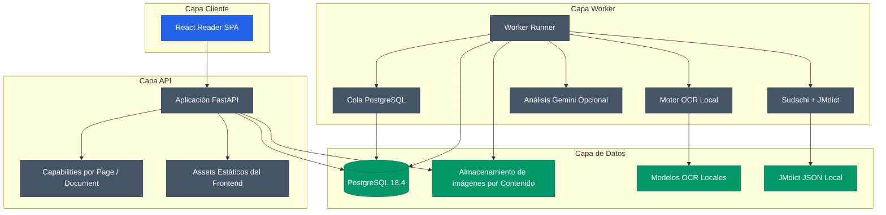

<div align="center">

# MangaSensei

**Lee manga. Entiende japonés. Mantén tus páginas en local.**

Un entorno de estudio centrado en la privacidad para convertir páginas de manga en material interactivo de japonés con OCR local, lingüística determinista y explicaciones opcionales por IA.

[English](README.md) · [Português](README.pt-BR.md) · [日本語](README.ja.md) · [Español](README.es.md)

</div>

[](https://github.com/Gyliardson/mangasensei/actions/workflows/ci.yml)
[](https://github.com/Gyliardson/mangasensei/releases)
[](LICENSE)
[](docs/versions.md)
[](docs/versions.md)
[](docs/versions.md)

MangaSensei extrae texto japonés de páginas de manga, enriquece el resultado con datos lingüísticos locales y lo presenta en un lector responsivo sin alterar la imagen original. Los pesos de OCR y los datos derivados de JMdict permanecen en local y no se incluyen en Git ni en la imagen distribuible. Gemini es opcional.

El contenido japonés puede estudiarse con **explicaciones contextuales en Portugués de Brasil (`pt-BR`) o Inglés (`en`)**. Los cuatro ejes de idioma son independientes: contenido japonés (`ja`), idioma de estudio/explicación (`pt-BR` o `en`), idioma solicitado para el diccionario determinista (`en`, `de` o `pt-BR`) y locale de interfaz guardado en el navegador (`en` o `pt-BR`). La interfaz y el diccionario usan inglés por defecto en estados nuevos o inválidos del navegador. Alemán usa el pack JMdict local revisado cuando existe la forma canónica exacta y, si no, hace fallback por elemento a inglés; una solicitud de diccionario `pt-BR` sigue siendo explícitamente Portugués de Brasil, pero los significados deterministas usan fallback en inglés porque no existe un pack JMdict revisado de glosas portuguesas a nivel de palabra. Cambiar el idioma del diccionario reutiliza el análisis lingüístico canónico persistido y no vuelve a ejecutar OCR, adquisición léxica de Sudachi ni Gemini. Consulta el [contrato de ejes de idioma](docs/study-languages.md) y el [contrato de packs JMdict](docs/jmdict-packs.md).

La SPA también puede crear un Document temporal y ordenado a partir de varias imágenes JPEG, PNG o WebP. El orden mostrado antes de la carga es el orden canónico; cada Page sigue siendo una unidad independiente de OCR/estudio; las páginas completadas pueden leerse mientras sus hermanas siguen procesándose; y el progreso agregado muestra contadores completados/en proceso/con fallo. Document y Pages hijas comparten la misma expiración exacta de 24 horas. La importación de PDF y retry/cancel masivos siguen aplazados. Consulta el [contrato de importación multiimagen](docs/document-imports.md).

La versión actual de desarrollo está registrada en [`VERSION`](VERSION).

## ¿Por qué MangaSensei?

| Local-first | Imagen original preservada | Diseñado para estudiar |
| --- | --- | --- |
| OCR, modelos y datos del diccionario son locales por defecto. | La página subida se conserva sin modificaciones y las capas de estudio se renderizan por separado. | Furigana, vocabulario, idiomas independientes de estudio y diccionario, datos lingüísticos y explicaciones contextuales se organizan alrededor de la lectura. |

## Vista previa del lector

<table>
  <tr>
    <td width="68%" align="center"><a href="docs/assets/reader-desktop-chromium.png"></a><br><sub>Escritorio</sub></td>
    <td width="32%" align="center"><a href="docs/assets/reader-mobile-chromium.png"></a><br><sub>Móvil</sub></td>
  </tr>
</table>

## Funciones

| Área | Capacidad |
| --- | --- |
| Carga | Subida segura standalone y Documents multiimagen ordenados/acotados, idioma de estudio explícito `pt-BR`/`en`, idempotencia y capabilities HMAC por Page/Document |
| OCR | Subconjunto local de Manga Image Translator con modelos verificados por checksum |
| Lingüística | Tokenización Sudachi y datos JMdict locales revisados en inglés/alemán proyectados sobre identidades léxicas canónicas independientes del idioma |
| Gemini | Explicaciones contextuales estructuradas opcionales en `pt-BR`/`en`, con control de presupuesto y `store=False` |
| Lector | SPA React con Blob autenticado, overlays SVG responsivos, navegación/progreso de Document, furigana, locale de interfaz `en`/`pt-BR`, idioma de estudio `pt-BR`/`en` y preferencia solicitada de diccionario `en`/`de`/`pt-BR`, todos independientes, con presentación explícita del fallback |
| Operación | Cola PostgreSQL, recuperación de leases, retención, readiness y métricas |

## Arquitectura



## Superficie de la API

| Método | Ruta | Propósito |
| --- | --- | --- |
| `POST` | `/api/v1/pages` | Sube una página de manga japonés y crea análisis con `studyLanguage` opcional (`pt-BR` por defecto o `en`) |
| `GET` | `/api/v1/pages/{page_id}` | Consulta estado, metadatos persistidos de idiomas/proyección y datos de estudio standalone completados usando el token de página |
| `GET` | `/api/v1/pages/{page_id}/image` | Devuelve la imagen standalone original mediante una respuesta Blob autenticada |
| `POST` | `/api/v1/pages/{page_id}/reprocess` | Encola reprocesamiento standalone de idioma de estudio/diccionario usando una capability de Page |
| `POST` | `/api/v1/documents` | Crea un Document multiimagen ordenado/idempotente y un job normal de análisis por cada Page hija |
| `GET` | `/api/v1/documents/{document_id}` | Consulta hijos ordenados y progreso agregado con `read:document` |
| `GET` | `/api/v1/documents/{document_id}/progress` | Consulta contadores mutuamente excluyentes completados/en proceso/con fallo |
| `GET` | `/api/v1/documents/{document_id}/pages/{page_id}` | Consulta un StudyPage miembro usando la capability de lectura del Document |
| `GET` | `/api/v1/documents/{document_id}/pages/{page_id}/image` | Devuelve la imagen original de un miembro usando `read:document-image` |
| `POST` | `/api/v1/documents/{document_id}/pages/{page_id}/reprocess` | Reprocesa exactamente un eje de idioma de una Page miembro usando `reprocess:document` |
| `GET` | `/health` | Health check del proceso |
| `GET` | `/ready` | Verificación de base de datos, almacenamiento y schema |
| `GET` | `/metrics` | Métricas Prometheus |

Los capability tokens de Document solo se envían en headers y expiran exactamente con el Document de 24 horas. La SPA actual los conserva únicamente en memoria durante la sesión activa de la página; no los coloca en URL, historial del navegador ni `localStorage`. Por tanto, recargar pierde el acceso activo al Document en lugar de persistir un secreto de forma insegura. La importación de PDF, retry masivo y cancelación real de Document todavía no están implementados.

## Ejecución Local

Requisitos:

| Herramienta | Versión compatible |
| --- | --- |
| Python | `3.11.x` |
| Node.js | objetivo `24 LTS`; `22.12+` compatible para tooling local |
| Docker | `28.x` |
| uv | Necesario para dependencias Python y gestión del lockfile |

Consulta [`docs/versions.md`](docs/versions.md) para la matriz revisada de la stack.

Instala dependencias y prepara los artefactos locales:

```powershell
py -3.11 -m uv sync --extra ocr
npm install
Copy-Item .env.example .env
.\.venv\Scripts\mangasensei.exe models download
.\.venv\Scripts\mangasensei.exe jmdict download
```

Genera secretos y configúralos en `.env` antes de ejecutar cualquier cosa que use base de datos, cola o API. Sustituye `POSTGRES_PASSWORD`, la contraseña dentro de `MANGASENSEI_DATABASE_URL` y el valor de `MANGASENSEI_CAPABILITY_PEPPERS` por valores aleatorios nuevos:

```powershell
python -c "import secrets; print(secrets.token_urlsafe(32))"
```

Gemini es opcional. Deja `GOOGLE_API_KEY` sin definir o en blanco para ejecutar el worker solo con OCR y lingüística locales; configura una clave no vacía para habilitar enriquecimiento contextual en el idioma de estudio seleccionado. Cuando está habilitado, solo se envían el texto OCR y candidatos léxicos mínimos por región (`id`, `surface`, `lemma`, `reading`). La imagen original, los significados del diccionario y el dataset JMdict local no se envían. Con Gemini deshabilitado, el OCR/tokenización japoneses y el vocabulario JMdict determinista local siguen disponibles, mientras que la traducción y explicación contextuales pueden estar ausentes.

Ejecuta con Docker Compose:

```powershell
docker compose up --build
```

Ejecuta los quality gates locales:

```powershell
.\.venv\Scripts\python.exe scripts/version.py check
.\.venv\Scripts\python.exe scripts/check_markdown_links.py
.\.venv\Scripts\python.exe -m ruff check backend/src tests scripts
.\.venv\Scripts\python.exe -m mypy backend/src
.\.venv\Scripts\python.exe -m pytest --cov
npm run lint
npm run typecheck
npm run test:coverage
npm run build
npm run e2e
```

## Estructura del Repositorio

```text
backend/      API Python, worker, migraciones, OCR y lingüística
frontend/     SPA React, componentes del lector y pruebas Playwright
docs/         Contratos técnicos, notas de versión y artefactos visuales
tests/        Pruebas unitarias e integración del backend
var/          Datos locales de runtime ignorados por Git
```

## Actividad del Proyecto

[](https://github.com/Gyliardson/mangasensei/graphs/contributors)
[](https://github.com/Gyliardson/mangasensei/commits/main)
[](https://github.com/Gyliardson/mangasensei/issues)
[](https://github.com/Gyliardson/mangasensei/discussions)

| Explora | Enlace |
| --- | --- |
| Colaboradores | [Personas que construyen MangaSensei](https://github.com/Gyliardson/mangasensei/graphs/contributors) |
| Historial | [Historial de commits](https://github.com/Gyliardson/mangasensei/commits/main) |
| Roadmap y bugs | [Issues](https://github.com/Gyliardson/mangasensei/issues) |
| Ideas y preguntas | [Discussions](https://github.com/Gyliardson/mangasensei/discussions) |
| Seguridad | [Resumen de seguridad](https://github.com/Gyliardson/mangasensei/security) |
| Releases | [GitHub Releases](https://github.com/Gyliardson/mangasensei/releases) |

## Contribución

Las contribuciones son bienvenidas en **English, Português, 日本語 o Español**. Lee la guía en tu idioma preferido:

[English](CONTRIBUTING.md) · [Português](CONTRIBUTING.pt-BR.md) · [日本語](CONTRIBUTING.ja.md) · [Español](CONTRIBUTING.es.md)

Sigue también el [Código de Conducta](CODE_OF_CONDUCT.es.md). Para vulnerabilidades, utiliza el canal privado descrito en la [Política de Seguridad](SECURITY.es.md).

## Datos y Licencias

El código fuente de MangaSensei usa GPL-3.0-only. Los datos derivados de JMdict se generan localmente desde fuentes de terceros verificadas y siguen sujetos a los términos EDRDG / CC BY-SA. Los pesos de los modelos OCR son artefactos locales y este repositorio no los redistribuye.

Consulta [`THIRD_PARTY_NOTICES.md`](THIRD_PARTY_NOTICES.md) para atribuciones, checksums y referencias de origen.

## Licencia

Copyright (C) 2026 Gyliardson Keitison. MangaSensei está licenciado bajo [GPL-3.0-only](LICENSE). Los componentes de terceros conservan sus respectivos avisos.
