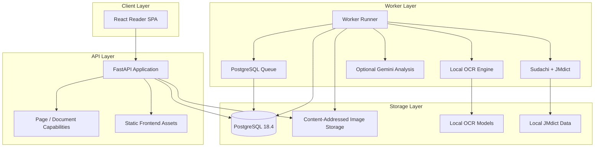

<div align="center">

# MangaSensei

**漫画を読む。日本語を理解する。ページはローカルに保つ。**

ローカル OCR、決定論的な言語解析、インタラクティブな読解機能、任意の AI 解説を組み合わせた、local-first の日本語漫画学習ワークスペースです。

**Status: pre-release / active development.** MangaSensei は現在ソースから実行できますが、安定版の公開 GitHub Release はまだありません。

[English](README.md) · [Português](README.pt-BR.md) · [日本語](README.ja.md) · [Español](README.es.md)

[](https://github.com/Gyliardson/mangasensei/actions/workflows/ci.yml)
[](LICENSE)

</div>

<p align="center">
  <a href="docs/assets/reader-desktop-chromium.png"></a>
  <br>
  <sub>現在の単一ページ reader preview。再現可能な専用 media と multipage presentation は次の workstream で整備します。</sub>
</p>

MangaSensei は元ページを変更せず保持し、学習情報を別レイヤーとして表示します。OCR、Sudachi tokenization、レビュー済み JMdict データは MangaSensei のローカル deployment 内で動作します。Gemini enrichment は任意で、完全に無効のまま利用できます。

## MangaSensei の考え方

| Local-first | Original-first | Study-first |
| --- | --- | --- |
| 基本 OCR・言語解析は cloud AI service に依存しません。 | upload した漫画画像は変更せず、OCR region と学習データを別に保持します。 | ふりがな、語彙、言語設定、zoom/fit、文脈学習を読解中心に構成します。 |

## Docker Compose Quick Start

これは visitor 向けの最短のサポート済み経路です。host に Python、Node.js、`uv` を入れる必要はありません。これらは開発 tooling の要件です。

### 1. Clone とローカル設定

必要なもの: Git、Docker、Docker Compose v2。

```sh
git clone https://github.com/Gyliardson/mangasensei.git
cd mangasensei
cp .env.example .env
```

PowerShell では:

```powershell
Copy-Item .env.example .env
```

独立したランダム値を 2 つ生成します。次のコマンドは MangaSensei が現在使う checksum-pinned Python base image と同じ image を使うため、この手順でも Docker だけが runtime prerequisite です。

```sh
docker run --rm python:3.11-slim-bookworm@sha256:d29f48a31a8b408ed19272ca1e7b10ebae13b240a27e862d3d4217c528e2e0c3 python -c "import secrets; print(secrets.token_urlsafe(32))"
```

2 回実行し、`.env` を編集します。

- 1 つ目を `POSTGRES_PASSWORD` に設定する。
- 2 つ目を `MANGASENSEI_CAPABILITY_PEPPERS=["..."]` の値に設定する。
- local-only OCR・言語解析を使う場合は `GOOGLE_API_KEY=` を空のままにする。

`.env.example` の `MANGASENSEI_DATABASE_URL` は host で backend を直接実行する開発用です。Docker Compose は container 内部用 database URL を別途設定するため、この Quick Start では編集不要です。

repository の placeholder をそのまま使ったり、`.env` を commit したりしないでください。

### 2. Build と起動

```sh
docker compose up --detach --build
```

fresh install では application build に加え、migration、checksum-pinned OCR model、レビュー済み英語・ドイツ語 JMdict data の one-shot bootstrap が実行され、その後 worker が ready になります。**初回 bootstrap には network access が必要です。** Container layer、OCR model artifact、JMdict source data を取得するためです。取得した artifact は以後ローカル Docker volume に保持され、通常のローカル処理に使われます。

`GOOGLE_API_KEY` が空なら Gemini は無効です。それでも日本語 OCR、Sudachi、決定論的 JMdict vocabulary は利用でき、AI の文脈 translation/explanation だけが存在しない場合があります。

### 3. Readiness を確認して reader を開く

```sh
docker compose ps --all
curl --fail http://127.0.0.1:8000/ready
```

PowerShell では:

```powershell
Invoke-RestMethod http://127.0.0.1:8000/ready
```

その後 **http://127.0.0.1:8000** を開き、JPEG・PNG・WebP または 1 つの PDF を解析します。複数画像は選択順を保持し、PDF は bounded な local render/import を完了してから同じ通常の順序付き Document になります。

bootstrap が失敗した場合:

```sh
docker compose logs models jmdict migrate api pdf-renderer pdf-importer worker
```

### 4. Stop / reset

ローカルの database/model/dictionary volume を残して停止:

```sh
docker compose down
```

MangaSensei のローカル Docker volume も削除:

```sh
docker compose down --volumes --remove-orphans
```

2 つ目は database state、upload image storage、OCR model、JMdict data を削除します。次の clean start では bootstrap download が再度必要です。

## Core workflow

通常の読解 session はシンプルです。

1. 対応画像 1 枚、順序付きの複数画像、または 1 つの PDF を選択する。
2. MangaSensei は元画像を保持し、各 Page をローカル OCR・言語解析へ queue する。
3. 完了した Page を responsive reader で開き、study overlay は source image と分離して表示する。
4. OCR region を選び、日本語 text、ふりがな、token、決定論的 dictionary vocabulary を確認する。
5. 必要な場合だけ Gemini を有効にして study language の文脈 enrichment を追加する。

mobile reader も responsive です。

<p align="center">
  <a href="docs/assets/reader-mobile-chromium.png"></a>
  <br>
  <sub>現在の mobile reader preview。</sub>
</p>

## Multipage workflow

[#105](https://github.com/Gyliardson/mangasensei/issues/105) の Slice B / C / D は、漫画 volume 全体を 1 個の巨大 OCR job にせず、順序付き複数画像 Document、partial result/recovery、hardened local PDF import を提供します。

**現在利用可能:**

- 複数 JPEG・PNG・WebP を選択し、upload 前に確認・並べ替えする。
- 1 つの PDF を bounded asynchronous local render/import に送り、全 raster 検証後だけ通常の Document を commit する。
- 1 つの PDF を bounded asynchronous local render/import に送り、全 raster 検証後だけ通常の Document を commit する。
- 画面上の upload 前の順序を Document の canonical initial order として保持する。
- 各 Page を独立した OCR / study / job 単位のままにする。
- processing / completed / completed-with-errors / cancelled の正確な aggregate state と、completed / processing / failed / cancelled Page 件数を表示する。
- sibling または後続 work が処理中・失敗・cancelled でも、完了済み Page を読み続ける。
- unreadable な failed Page のみを bounded/idempotent な Document operation で retry し、成功済み sibling を再計算しない。
- すでに完了した sibling を書き換えず、active Document processing を cooperative に cancel する。
- optimistic concurrency を使って作成後の Page order を persisted に更新する。
- direct page selection と Previous / Next で移動する。
- study language / dictionary language の reprocess は current Page のみ行う。
- Document と全 child Page が同一の正確な 24 時間 retention boundary を共有する。

**#105 で引き続き未実装:** thumbnail、persistent manga library、spread-aware / cross-page reading-order semantics、後続の large-document/performance hardening。

詳細は [multi-image Document contract](docs/document-imports.md) を参照してください。

## Current validation

### OCR / product-quality evidence

MangaSensei は現在、汎用的な OCR accuracy percentage を公開していません。CI test 数や code coverage は engineering assurance であり、OCR accuracy ではありません。

現在の OCR evidence:

- deterministic synthetic OCR regression と real-model CPU compatibility smoke。
- provenance と handling rule を明記し checksum 検証した **12-page licensed real-manga pressure corpus**。
- short vertical-text recall、recognizer/context regression、特定 graphic-texture precision guard の reviewed real-page anchor。
- reviewed corpus 上の controlled OpenCV 4→5 compatibility study。recognizer warp の bounded pixel drift はあったものの、accepted/final text、final geometry、reading order、reviewed pressure case に変化はありませんでした。

12-page pressure corpus は全ページについて exhaustive transcript-level ground truth を持つものではありません。広い characterization page は完全な transcript truth ではなく regression/characterization contract を使うため、この dataset から corpus-wide CER、detection precision/recall、"99% accuracy" を主張しません。

既知の OCR limitation として、detached bōten/emphasis geometry ([#93](https://github.com/Gyliardson/mangasensei/issues/93))、high-confidence similar-glyph substitution ([#99](https://github.com/Gyliardson/mangasensei/issues/99))、high-confidence graphic-symbol false-positive class ([#100](https://github.com/Gyliardson/mangasensei/issues/100)) を追跡しています。

正確な assurance boundary は [testing strategy](docs/testing.md) と [licensed corpus contract](tests/fixtures/ocr/real_manga/black_jack/README.md) を参照してください。

### Engineering assurance

通常の CI は、backend lint/type/test+coverage、frontend lint/typecheck/unit coverage/build、mocked Playwright desktop/mobile/accessibility、deterministic external OCR/Gemini boundary を使う real browser → FastAPI → PostgreSQL full-stack critical flow、production Docker build/runtime、wheel/sdist clean install、secret/dependency security check を分離して検証します。CodeQL は独立して実行され、JMdict data-contract workflow は source→runtime dictionary integrity と clean Compose bootstrap/readiness を検証します。

詳細は [docs/testing.md](docs/testing.md) と [`.github/workflows/`](.github/workflows/) にあります。

## Privacy / local-first boundary

- 元の漫画画像は MangaSensei deployment 内に留まり、Gemini へ送信されません。
- OCR は checksum-verified model artifact を使ってローカル実行します。
- Sudachi tokenization と reviewed JMdict data はローカルです。
- Gemini は任意です。有効時に既存 contract が送るのは OCR text と region-scoped の最小 lexical candidate (`id`, `surface`, `lemma`, `reading`) です。元画像、JMdict dataset、deterministic dictionary meaning は送りません。request は `store=False` を使います。
- Page / Document access は UUID を authorization と見なさず scoped capability token を使います。
- Page / Document data は現在の正確な 24 時間 retention contract に従い、reading や language reprojection で延長しません。

"Local-first" は必要な artifact が利用可能になった後の processing/data boundary を表します。fresh Docker bootstrap は pinned model、dictionary source、container layer の download に network が必要です。Gemini は有効時だけ provider access を必要とします。

詳細は [SECURITY.ja.md](SECURITY.ja.md)、[docs/document-imports.md](docs/document-imports.md)、[docs/testing.md](docs/testing.md) を参照してください。

## Language / study features

4 つの言語軸は独立しています。

| Axis | 現在の support |
| --- | --- |
| 漫画 content | 日本語 (`ja`) |
| Study / contextual explanation | ブラジルポルトガル語 (`pt-BR`) または英語 (`en`) |
| Requested deterministic dictionary language | 英語 (`en`)、ドイツ語 (`de`)、ブラジルポルトガル語 (`pt-BR`) |
| UI locale | 英語 (`en`) またはブラジルポルトガル語 (`pt-BR`) |

ドイツ語は exact canonical form が reviewed local JMdict pack にある場合に使われ、それ以外は item ごとに英語へ fallback します。`pt-BR` dictionary request は requested language として保持されますが、reviewed word-level Portuguese JMdict gloss pack がないため、deterministic word meaning は現在英語 fallback です。dictionary language の変更は persisted canonical linguistic analysis を再利用し、OCR、Sudachi lexical acquisition、Gemini を再実行しません。

詳細は [language-axis contract](docs/study-languages.md) と [JMdict pack contract](docs/jmdict-packs.md) を参照してください。

## Features

| Area | Capability |
| --- | --- |
| Upload | 安全な standalone image、bounded ordered multi-image Document、idempotency/scoped capability を持つ hardened local PDF import |
| OCR | checksum-verified model artifact を使う local Manga Image Translator subset |
| Linguistics | language-neutral canonical lexical identity 上の Sudachi tokenization と reviewed local English/German JMdict data |
| Reader | authenticated original-image Blob、responsive SVG overlay、ふりがな、zoom/fit、multipage navigation、partial-result reading |
| Languages | UI / study-explanation / requested dictionary preferences を独立管理し fallback を明示 |
| Gemini | optional `pt-BR`/`en` structured contextual explanation、budget tracking、minimal text context、`store=False` |
| Operations | PostgreSQL queue、lease recovery、bounded retention、readiness、metrics、hardened Compose runtime |

## Known limitations / pre-release scope

MangaSensei は pre-release software です。上記 OCR limitation に加えて:

- Document は temporary で、persistent manga library ではありません。
- thumbnail と spread-aware/cross-page reading order は未実装です。
- large-document/performance の追加 hardening は #105 の後続 work として未実装です。
- Document capability token は active browser page session のみに保持されるため、reload すると sensitive token を不安全に永続化する代わりに access を失います。
- Gemini の contextual output は optional enrichment であり、local OCR/JMdict study の必須要件ではありません。

現在の開発 version は [`VERSION`](VERSION) にあります。roadmap/known defect は [issues](https://github.com/Gyliardson/mangasensei/issues) を参照してください。

## Architecture



production Compose stack は PostgreSQL、one-shot model/JMdict/migration bootstrap、FastAPI/frontend、worker、retention を実行します。application runtime は Linux capability drop、`no-new-privileges`、non-root execution、適用可能な read-only filesystem を維持します。

## Engineering quality / development

### Development toolchain

上の Docker Quick Start が visitor path です。host-native development では [docs/versions.md](docs/versions.md) の reviewed version、Python 3.11、Node.js 24 LTS target（current tooling は `22.12+` support）、`uv` を使います。

代表的な dependency/bootstrap command:

```sh
uv sync --extra ocr
npm install
uv run mangasensei models download
uv run mangasensei models verify
uv run mangasensei jmdict download
uv run mangasensei jmdict download --language de
```

host で直接動かす場合は `.env.example` から `.env` を作り、その comment に従って host database URL の password も同じ生成値に合わせます。完全な stack を動かす最も簡単な supported path は Docker Compose です。

<details>
<summary>Local quality gates</summary>

```sh
uv run python scripts/version.py check
uv run python scripts/check_markdown_links.py
uv run ruff check backend/src tests scripts
uv run mypy backend/src
uv run pytest --cov
npm run lint
npm run typecheck
npm run test:coverage
npm run build
npm run e2e
```

重い OCR、clean Compose、CodeQL、release/distribution assurance は [docs/testing.md](docs/testing.md) を参照してください。

</details>

### Contribution / project activity

**English, Português, 日本語, Español** で contribution を歓迎します。

[Contribution guide](CONTRIBUTING.ja.md) · [Code of Conduct](CODE_OF_CONDUCT.ja.md) · [Security policy](SECURITY.ja.md) · [Issues](https://github.com/Gyliardson/mangasensei/issues) · [Discussions](https://github.com/Gyliardson/mangasensei/discussions) · [Contributors](https://github.com/Gyliardson/mangasensei/graphs/contributors)

## API / deeper documentation

MangaSensei 起動中は FastAPI の interactive API docs を `/api/docs` で利用できます。Page / Document resource は capability-protected のままです。

<details>
<summary>Core API surface</summary>

| Method | Route | Purpose |
| --- | --- | --- |
| `POST` | `/api/v1/pages` | 日本語漫画 Page 1 枚を upload し解析を queue |
| `GET` | `/api/v1/pages/{page_id}` | read capability で standalone Page を取得 |
| `GET` | `/api/v1/pages/{page_id}/image` | protected standalone original image を取得 |
| `POST` | `/api/v1/pages/{page_id}/reprocess` | standalone Page の言語軸 1 つを reprocess |
| `POST` | `/api/v1/documents` | ordered multi-image Document を作成 |
| `GET` | `/api/v1/documents/{document_id}` | ordered child summary、aggregate status、progress を取得 |
| `GET` | `/api/v1/documents/{document_id}/progress` | completed/processing/failed/cancelled counters を取得 |
| `GET` | `/api/v1/documents/{document_id}/pages/{page_id}` | member StudyPage を取得 |
| `GET` | `/api/v1/documents/{document_id}/pages/{page_id}/image` | protected member original image を取得 |
| `POST` | `/api/v1/documents/{document_id}/pages/{page_id}/reprocess` | member Page の言語軸 1 つを reprocess |
| `POST` | `/api/v1/documents/{document_id}/retry-failed` | eligible な unreadable failed member Page を idempotent に retry |
| `POST` | `/api/v1/documents/{document_id}/cancel` | active Document work の cooperative cancellation を request |
| `PUT` | `/api/v1/documents/{document_id}/order` | optimistic concurrency で完全な member order を persisted に更新 |
| `GET` | `/health` | process health |
| `GET` | `/ready` | database/storage/schema readiness |
| `GET` | `/metrics` | Prometheus metrics |

</details>

主な詳細 documentation:

- [Multi-image Document imports](docs/document-imports.md)
- [Study / language-axis contract](docs/study-languages.md)
- [Reviewed JMdict packs](docs/jmdict-packs.md)
- [Testing strategy](docs/testing.md)
- [Reviewed stack versions](docs/versions.md)
- [Security policy](SECURITY.ja.md)
- [Third-party notices](THIRD_PARTY_NOTICES.md)

## Data / licensing

MangaSensei source code は GPL-3.0-only です。JMdict-derived data は checksum-verified third-party source からローカル生成され、EDRDG / CC BY-SA terms に従います。OCR model weight は local artifact であり、この repository は再配布しません。

OCR pressure test に使う licensed real-manga fixture には copyright holder 独自の terms があり、MangaSensei GPL の対象ではありません。test fixture として repository に存在することを、general-purpose public demo/media license と解釈しないでください。[fixture contract](tests/fixtures/ocr/real_manga/black_jack/README.md) を参照してください。

attribution、integrity reference、source detail は [`THIRD_PARTY_NOTICES.md`](THIRD_PARTY_NOTICES.md) を参照してください。

## License

Copyright (C) 2026 Gyliardson Keitison. MangaSensei は [GPL-3.0-only](LICENSE) でライセンスされています。Third-party component/data にはそれぞれの notice/terms が適用されます。
