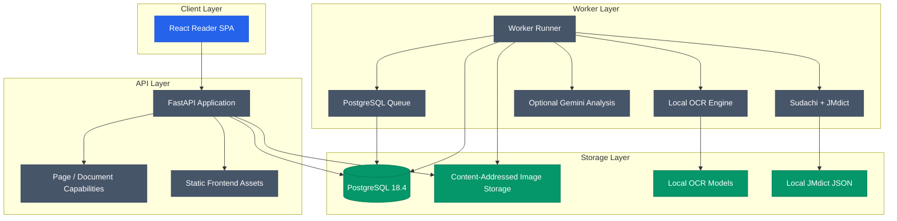

<div align="center">

# MangaSensei

**漫画を読む。日本語を理解する。ページはローカルに保つ。**

ローカル OCR、決定論的な言語解析、任意の AI 解説を使って、漫画ページをインタラクティブな日本語学習素材に変えるプライバシー重視の学習環境です。

[English](README.md) · [Português](README.pt-BR.md) · [日本語](README.ja.md) · [Español](README.es.md)

</div>

[](https://github.com/Gyliardson/mangasensei/actions/workflows/ci.yml)
[](https://github.com/Gyliardson/mangasensei/releases)
[](LICENSE)
[](docs/versions.md)
[](docs/versions.md)
[](docs/versions.md)

MangaSensei は漫画ページから日本語テキストを抽出し、ローカルの言語データで補強して、元画像を変更せずレスポンシブなリーダーに表示します。OCR モデルの重みと JMdict 由来データはローカルに保持され、Git にコミットされず配布イメージにも含まれません。Gemini は任意です。

日本語コンテンツは、**ブラジルポルトガル語（`pt-BR`）または英語（`en`）の文脈解説**で学習できます。言語には独立した 4 つの軸があります。コンテンツは日本語（`ja`）、学習・解説言語は `pt-BR` または `en`、決定論的な辞書の要求言語は `en`・`de`・`pt-BR`、ブラウザに保存される UI locale は `en` または `pt-BR` です。UI locale と辞書言語は、新規または無効なブラウザ状態では英語を既定値とします。ドイツ語は正確な正規形がレビュー済みローカル JMdict pack に存在する場合に使われ、存在しない項目だけ英語へフォールバックします。`pt-BR` 辞書要求は要求言語として維持されますが、レビュー済みの単語レベルのポルトガル語 JMdict pack がないため、決定論的な語義は英語フォールバックです。辞書言語の変更は永続化済みの正規言語解析を再利用し、OCR、Sudachi の語彙取得、Gemini を再実行しません。詳細は[言語軸コントラクト](docs/study-languages.md)と[JMdict pack コントラクト](docs/jmdict-packs.md)を参照してください。

SPA は複数の JPEG・PNG・WebP 画像から、一時的で順序付きの Document も作成できます。アップロード前に表示・変更した順序が正規順序で、各 Page は独立した OCR・学習単位のままです。完了した Page は他の Page が処理中でも読め、集約進捗は完了・処理中・失敗の件数を示します。Document と子 Page は同一の正確な 24 時間 expiry を共有します。PDF import と一括 retry/cancel はこの Slice では未実装です。詳細は[複数画像 Document import コントラクト](docs/document-imports.md)を参照してください。

現在の開発バージョンは [`VERSION`](VERSION) に記録されています。

## MangaSensei の考え方

| Local-first | Original-first | Study-first |
| --- | --- | --- |
| OCR、モデル、辞書データは既定でローカルです。 | アップロードした漫画画像はそのまま保持し、学習用オーバーレイを別に描画します。 | ふりがな、語彙、独立した学習言語と辞書言語、言語情報、文脈解説を読解の流れに沿って整理します。 |

## リーダープレビュー

<table>
  <tr>
    <td width="68%" align="center"><a href="docs/assets/reader-desktop-chromium.png"></a><br><sub>デスクトップ</sub></td>
    <td width="32%" align="center"><a href="docs/assets/reader-mobile-chromium.png"></a><br><sub>モバイル</sub></td>
  </tr>
</table>

## 機能

| 領域 | 内容 |
| --- | --- |
| アップロード | standalone 画像と上限付き順序付き複数画像 Document の安全な upload、明示的な `pt-BR`/`en` 学習言語、冪等性、Page/Document 単位 HMAC capability |
| OCR | チェックサムで検証された Manga Image Translator のローカル OCR サブセット |
| 言語解析 | Sudachi トークン化と、言語非依存の正規 lexical identity に投影されるレビュー済みローカル英語・ドイツ語 JMdict データ |
| Gemini | 予算追跡と `store=False` を使う任意の `pt-BR`/`en` 構造化文脈解説 |
| リーダー | 認証付き Blob、レスポンシブ SVG オーバーレイ、Document navigation/集約進捗、ふりがな、独立した `en`/`pt-BR` UI locale、`pt-BR`/`en` 学習言語、`en`/`de`/`pt-BR` 辞書要求と明示的なフォールバック表示を備えた React SPA |
| 運用 | PostgreSQL キュー、lease 回復、保持処理、readiness、metrics |

## アーキテクチャ



## API

| Method | Route | Purpose |
| --- | --- | --- |
| `POST` | `/api/v1/pages` | 日本語漫画ページを standalone upload し、任意の `studyLanguage`（既定 `pt-BR` または `en`）で解析 job をキューに登録する |
| `GET` | `/api/v1/pages/{page_id}` | Page token で standalone Page の状態、永続化された言語・辞書 projection metadata、完了済み学習データを取得する |
| `GET` | `/api/v1/pages/{page_id}/image` | standalone 元画像を認証付き Blob response で返す |
| `POST` | `/api/v1/pages/{page_id}/reprocess` | Page capability で standalone の学習言語・辞書言語 reprocess をキューに登録する |
| `POST` | `/api/v1/documents` | 順序付きで冪等な複数画像 Document を作成し、各子 Page に通常の解析 job を 1 件作る |
| `GET` | `/api/v1/documents/{document_id}` | `read:document` で順序付き子 summary と集約進捗を取得する |
| `GET` | `/api/v1/documents/{document_id}/progress` | 完了・処理中・失敗の排他的な件数を取得する |
| `GET` | `/api/v1/documents/{document_id}/pages/{page_id}` | Document read capability で member StudyPage を取得する |
| `GET` | `/api/v1/documents/{document_id}/pages/{page_id}/image` | `read:document-image` で member の元画像を取得する |
| `POST` | `/api/v1/documents/{document_id}/pages/{page_id}/reprocess` | `reprocess:document` で member Page の言語軸を 1 つだけ再処理する |
| `GET` | `/health` | プロセスの health check |
| `GET` | `/ready` | データベース、storage、schema の readiness check |
| `GET` | `/metrics` | Prometheus metrics |

Document capability token は header のみで送信し、24 時間の Document と正確に同時に失効します。現在の SPA は token を active page session のメモリだけに保持し、URL・browser history・`localStorage` には保存しません。そのため reload 後は、secret を安全でない場所に永続化する代わりに active Document access を失います。PDF import、一括 retry、実際の Document cancel は未実装です。

## ローカル実行

前提ツール:

| Tool | Supported version |
| --- | --- |
| Python | `3.11.x` |
| Node.js | `24 LTS` をターゲット、ローカル tooling は `22.12+` をサポート |
| Docker | `28.x` |
| uv | Python 依存関係と lockfile 管理に必要 |

レビュー済みスタックは [`docs/versions.md`](docs/versions.md) を参照してください。

依存関係とローカルデータを準備します:

```powershell
py -3.11 -m uv sync --extra ocr
npm install
Copy-Item .env.example .env
.\.venv\Scripts\mangasensei.exe models download
.\.venv\Scripts\mangasensei.exe jmdict download
```

データベース、キュー、API を実行する前に `.env` のシークレットを生成してください。`POSTGRES_PASSWORD`、`MANGASENSEI_DATABASE_URL` 内のパスワード、`MANGASENSEI_CAPABILITY_PEPPERS` 内の値を新しいランダム値に置き換えます:

```powershell
python -c "import secrets; print(secrets.token_urlsafe(32))"
```

Gemini は任意です。ローカル OCR と言語解析だけで worker を実行する場合は `GOOGLE_API_KEY` を未設定または空のままにし、選択した学習言語で文脈補強を有効にする場合のみ空でないキーを設定してください。有効にした場合、送信されるのは OCR テキストとリージョン単位の最小限の語彙候補（`id`、`surface`、`lemma`、`reading`）だけです。元画像、辞書の意味、ローカル JMdict データセットは送信されません。Gemini を無効にしても日本語 OCR・トークン化と決定論的ローカル JMdict 語彙は利用でき、文脈翻訳・解説だけが欠ける場合があります。

Docker Compose で起動:

```powershell
docker compose up --build
```

ローカル quality gates:

```powershell
.\.venv\Scripts\python.exe scripts/version.py check
.\.venv\Scripts\python.exe scripts/check_markdown_links.py
.\.venv\Scripts\python.exe -m ruff check backend/src tests scripts
.\.venv\Scripts\python.exe -m mypy backend/src
.\.venv\Scripts\python.exe -m pytest --cov
npm run lint
npm run typecheck
npm run test:coverage
npm run build
npm run e2e
```

## リポジトリ構成

```text
backend/      Python API、worker、migrations、OCR、言語解析
frontend/     React SPA、reader components、Playwright tests
docs/         技術コントラクト、バージョン情報、ビジュアル資料
tests/        Backend unit/integration tests
var/          Git 管理外のローカル runtime data
```

## プロジェクト活動

[](https://github.com/Gyliardson/mangasensei/graphs/contributors)
[](https://github.com/Gyliardson/mangasensei/commits/main)
[](https://github.com/Gyliardson/mangasensei/issues)
[](https://github.com/Gyliardson/mangasensei/discussions)

| Explore | Link |
| --- | --- |
| Contributors | [MangaSensei を作る人たち](https://github.com/Gyliardson/mangasensei/graphs/contributors) |
| History | [Commit history](https://github.com/Gyliardson/mangasensei/commits/main) |
| Roadmap and bugs | [Issues](https://github.com/Gyliardson/mangasensei/issues) |
| Ideas and questions | [Discussions](https://github.com/Gyliardson/mangasensei/discussions) |
| Security | [Security overview](https://github.com/Gyliardson/mangasensei/security) |
| Releases | [GitHub Releases](https://github.com/Gyliardson/mangasensei/releases) |

## コントリビューション

**English、Português、日本語、Español** のいずれでもコントリビューションできます。希望する言語のガイドを参照してください:

[English](CONTRIBUTING.md) · [Português](CONTRIBUTING.pt-BR.md) · [日本語](CONTRIBUTING.ja.md) · [Español](CONTRIBUTING.es.md)

[行動規範](CODE_OF_CONDUCT.ja.md)にも従ってください。脆弱性は[セキュリティポリシー](SECURITY.ja.md)に記載された非公開チャネルから報告してください。

## データとライセンス

MangaSensei のソースコードは GPL-3.0-only です。JMdict 由来データは検証済み第三者ソースからローカル生成され、EDRDG / CC BY-SA の条件に従います。OCR モデルの重みはローカル成果物であり、このリポジトリから再配布しません。

帰属、チェックサム、ソース参照は [`THIRD_PARTY_NOTICES.md`](THIRD_PARTY_NOTICES.md) を参照してください。

## ライセンス

Copyright (C) 2026 Gyliardson Keitison. MangaSensei は [GPL-3.0-only](LICENSE) でライセンスされています。第三者コンポーネントにはそれぞれの通知が適用されます。
