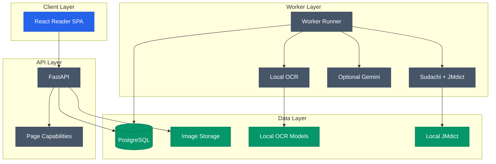

# MangaSensei

[](CHANGELOG.md)
[](LICENSE)
[](docs/versions.md)
[](docs/versions.md)

MangaSensei は、漫画ページの元画像を変更せずに日本語テキストを抽出し、
決定論的な言語情報と文脈に応じた解説を提供するローカル学習環境です。

ドキュメント: [English](README.md) | [Português](README.pt-BR.md) |
[日本語](README.ja.md) | [Español](README.es.md)

> バージョン 0.1.0 はローカル MVP です。OCR モデルの重みと JMdict 由来データはローカルで取得され、Git や配布用コンテナイメージには含まれません。

## 機能

| 領域 | 内容 |
| --- | --- |
| アップロード | 画像アップロード、冪等性、ページ単位の HMAC capability |
| OCR | チェックサムで検証された Manga Image Translator のローカル OCR サブセット |
| 言語解析 | Sudachi と検証済みソースから生成する正規化 JMdict |
| Gemini | `store=False` と予算管理を使う任意の構造化解説 |
| リーダー | 認証付き Blob、レスポンシブ SVG、ふりがな、語彙カードを備えた React SPA |
| 運用 | PostgreSQL キュー、lease 回復、保持期間処理、readiness、metrics |

## アーキテクチャ



## ローカル実行

```powershell
py -3.11 -m uv sync --extra ocr
npm install
Copy-Item .env.example .env
.\.venv\Scripts\mangasensei.exe models download
.\.venv\Scripts\mangasensei.exe jmdict download
docker compose up --build
```

データベース、キュー、API を使う前に、`.env` のシークレットを生成して置き換えてください: `POSTGRES_PASSWORD`、`MANGASENSEI_DATABASE_URL` 内のパスワード、`MANGASENSEI_CAPABILITY_PEPPERS` 内の値:

```powershell
python -c "import secrets; print(secrets.token_urlsafe(32))"
```

## 主な API

| Method | Route | Purpose |
| --- | --- | --- |
| `POST` | `/api/v1/pages` | ページをアップロードし、解析 job を作成する |
| `GET` | `/api/v1/pages/{page_id}` | ページトークンで解析結果を取得する |
| `GET` | `/api/v1/pages/{page_id}/image` | 認証付きで元画像を返す |
| `POST` | `/api/v1/pages/{page_id}/reprocess` | 専用 capability で再処理を開始する |

## ビジュアル資料

| View | Path |
| --- | --- |
| Desktop reader | `docs/assets/reader-desktop-chromium.png` |
| Mobile reader | `docs/assets/reader-mobile-chromium.png` |

## ディレクトリ構成

```text
backend/      Python API、worker、migrations、OCR、言語解析
frontend/     React SPA と Playwright テスト
docs/         バージョン情報と画面キャプチャ
tests/        Backend の unit/integration tests
var/          Git で管理しないローカルデータ
```

## コントリビューション

コントリビューションを歓迎します。issue や pull request を開く前に
[`CONTRIBUTING.md`](CONTRIBUTING.md) を読み、[`Code of Conduct`](CODE_OF_CONDUCT.md) に従ってください。
セキュリティ問題は [`SECURITY.md`](SECURITY.md) に記載の非公開チャネルをご利用ください。

## ライセンス

Copyright (C) 2026 Gyliardson Keitison. MangaSensei のコードは GPL-3.0-only です。JMdict データと第三者コンポーネントは、それぞれのライセンスと `THIRD_PARTY_NOTICES.md` の通知に従います。
