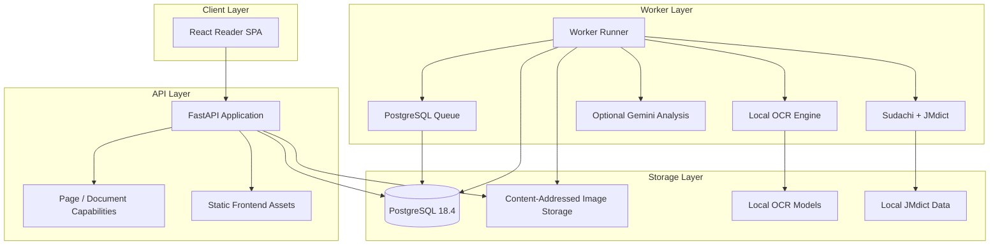

<div align="center">

# MangaSensei

**Read manga. Understand Japanese. Keep your pages local.**

A local-first Japanese manga study workspace with OCR, deterministic linguistics, interactive reading tools, and optional AI explanations.

**Status: pre-release / active development.** MangaSensei is usable from source today, but no stable public GitHub Release has been published yet.

[English](README.md) · [Português](README.pt-BR.md) · [日本語](README.ja.md) · [Español](README.es.md)

[](https://github.com/Gyliardson/mangasensei/actions/workflows/ci.yml)
[](LICENSE)

</div>

<p align="center">
  <a href="docs/assets/reader-desktop-chromium.png"></a>
  <br>
  <sub>Current single-page reader preview. Dedicated reproducible and multi-page presentation media is a follow-up workstream.</sub>
</p>

MangaSensei preserves the original page and renders study information separately. OCR, Sudachi tokenization, and reviewed JMdict dictionary data run locally in your MangaSensei deployment. Gemini enrichment is optional and can remain completely disabled.

## Why MangaSensei?

| Local-first | Original-first | Study-first |
| --- | --- | --- |
| Fundamental OCR and linguistic analysis do not depend on a cloud AI service. | Uploaded manga images stay unchanged; OCR regions and study information are separate overlays/data. | Furigana, vocabulary, language preferences, zoom/fit controls, and contextual study information are built around reading. |

## Quick Start with Docker Compose

This is the shortest supported visitor path. It does **not** require host Python, Node.js, or `uv`; those are development-tooling requirements, not Docker Quick Start requirements.

### 1. Clone and create local configuration

Requirements: Git, Docker, and Docker Compose v2.

```sh
git clone https://github.com/Gyliardson/mangasensei.git
cd mangasensei
cp .env.example .env
```

PowerShell uses:

```powershell
Copy-Item .env.example .env
```

Generate two independent random values. The command below uses the same checksum-pinned Python base image currently used by MangaSensei, so Docker is the only runtime prerequisite for this step:

```sh
docker run --rm python:3.11-slim-bookworm@sha256:d29f48a31a8b408ed19272ca1e7b10ebae13b240a27e862d3d4217c528e2e0c3 python -c "import secrets; print(secrets.token_urlsafe(32))"
```

Run it twice, then edit `.env`:

- replace `POSTGRES_PASSWORD` with the first value;
- replace the value inside `MANGASENSEI_CAPABILITY_PEPPERS=["..."]` with the second value;
- leave `GOOGLE_API_KEY=` blank for local-only OCR and linguistics.

`MANGASENSEI_DATABASE_URL` in `.env.example` is for direct host development. Docker Compose supplies its own container-internal database URL, so it does not need to be edited for this Quick Start.

Never reuse repository placeholders or commit your `.env` file.

### 2. Build and start MangaSensei

```sh
docker compose up --detach --build
```

On a fresh installation, this builds the application and runs one-shot bootstrap services for migrations, checksum-pinned OCR models, and reviewed English/German JMdict data before the worker becomes ready. **The first bootstrap requires network access** to obtain container layers, OCR model artifacts, and JMdict source data. Those artifacts are then kept in local Docker volumes for subsequent local processing.

Gemini remains disabled when `GOOGLE_API_KEY` is blank. Japanese OCR, Sudachi analysis, and deterministic JMdict vocabulary still work; contextual AI translation/explanation fields may be absent.

### 3. Check readiness and open the reader

```sh
docker compose ps --all
curl --fail http://127.0.0.1:8000/ready
```

PowerShell can use:

```powershell
Invoke-RestMethod http://127.0.0.1:8000/ready
```

Then open **http://127.0.0.1:8000** and analyze a JPEG, PNG, WebP, or one PDF manga source. Multiple supported images keep their chosen order; a PDF is rendered locally first and then becomes the same ordinary ordered temporary Document model.

If bootstrap fails, inspect the relevant service logs:

```sh
docker compose logs models jmdict migrate api pdf-renderer pdf-importer worker
```

### 4. Stop or reset

Stop containers while keeping local database/model/dictionary volumes:

```sh
docker compose down
```

Delete the local MangaSensei Docker volumes as well:

```sh
docker compose down --volumes --remove-orphans
```

The second command removes local database state, uploaded-page storage, OCR models, and JMdict data; the bootstrap downloads will be required again on the next clean start.

## Core workflow

A normal reading session is intentionally simple:

1. Select one supported manga image, an ordered set of images, or one PDF.
2. MangaSensei preserves the original image and queues each Page for local OCR and linguistic analysis.
3. Open completed pages in the responsive reader while study overlays remain separate from the source image.
4. Select OCR regions to inspect Japanese text, furigana, tokens, and deterministic dictionary vocabulary.
5. Optionally enable Gemini for contextual study-language enrichment.

The existing mobile reader is responsive as well:

<p align="center">
  <a href="docs/assets/reader-mobile-chromium.png"></a>
  <br>
  <sub>Current mobile reader preview.</sub>
</p>

## Multi-page workflow

Slices B, C and D of [#105](https://github.com/Gyliardson/mangasensei/issues/105) support ordered multi-image Documents, partial results/recovery controls, and hardened local PDF import without turning a manga volume into one giant OCR job.

**Available now:**

- select multiple JPEG, PNG, or WebP images and inspect/reorder them before upload;
- select one PDF for a bounded asynchronous local render/import stage; every raster is validated before the normal ordered Document is committed;
- select one PDF for a bounded asynchronous local render/import stage; every raster is validated before the normal ordered Document is committed;
- preserve that displayed pre-upload order as the Document's canonical initial order;
- keep each Page as an independent OCR/study/job unit;
- show truthful aggregate processing, completed, completed-with-errors, and cancelled states with completed / processing / failed / cancelled page counts;
- keep completed Pages readable while sibling or later work is still processing, fails, or is cancelled;
- retry unreadable failed Pages through one bounded/idempotent Document operation without recomputing successful siblings;
- cooperatively cancel active Document processing without rewriting already completed siblings;
- persist post-create page order with optimistic concurrency;
- navigate by direct page selection plus Previous / Next;
- reprocess study language or dictionary language only for the current Page;
- keep the Document and all child Pages on the same exact 24-hour retention boundary.

**Still deferred under #105:** thumbnails, a persistent manga library, spread-aware/cross-page reading-order semantics, and later large-document/performance hardening.

See the [multi-image Document contract](docs/document-imports.md) for limits, capabilities, idempotency, retention, recovery, and failure semantics.

## Current validation

### OCR and product-quality evidence

MangaSensei does **not** currently publish a universal OCR accuracy percentage. CI test counts and code coverage are engineering assurance, not OCR accuracy.

Current OCR evidence includes:

- deterministic synthetic OCR regressions and a real-model CPU compatibility smoke;
- a checksum-verified **12-page licensed real-manga pressure corpus** with documented provenance and handling rules;
- reviewed real-page anchors for short vertical-text recall, recognizer/context regressions, and a specific graphic-texture precision guard;
- a controlled OpenCV 4→5 compatibility study on the reviewed corpus that found bounded recognizer-warp pixel drift without changes to accepted/final text, final geometry, reading order, or the reviewed pressure cases.

The 12-page pressure corpus intentionally does **not** provide exhaustive transcript-level ground truth for every page. The wider pages use regression/characterization contracts rather than invented full-page truth, so MangaSensei does not claim corpus-wide CER, detection precision/recall, or "99% accuracy" from that dataset.

Known OCR limitations remain tracked, including detached bōten/emphasis geometry ([#93](https://github.com/Gyliardson/mangasensei/issues/93)), high-confidence similar-glyph substitutions ([#99](https://github.com/Gyliardson/mangasensei/issues/99)), and a high-confidence graphic-symbol false positive class ([#100](https://github.com/Gyliardson/mangasensei/issues/100)).

See the [testing strategy](docs/testing.md) and [licensed corpus contract](tests/fixtures/ocr/real_manga/black_jack/README.md) for the exact assurance boundaries.

### Engineering assurance

The normal CI pipeline separately validates backend lint/type safety/tests with coverage, frontend lint/typecheck/unit coverage/build, mocked Playwright desktop/mobile/accessibility behavior, a real browser → FastAPI → PostgreSQL full-stack critical flow with deterministic external OCR/Gemini boundaries, production Docker build/runtime checks, wheel/sdist clean-install checks, and secret/dependency security checks. CodeQL runs independently, and the JMdict data-contract workflow verifies source-to-runtime dictionary integrity plus clean Compose bootstrap/readiness.

These gates are described in [docs/testing.md](docs/testing.md) and implemented under [`.github/workflows/`](.github/workflows/).

## Privacy and local-first boundaries

- Original manga images stay inside your MangaSensei deployment and are never sent to Gemini.
- OCR runs locally with checksum-verified model artifacts.
- Sudachi tokenization and reviewed JMdict dictionary data are local.
- Gemini is optional. When enabled, the existing contract sends OCR text plus minimal region-scoped lexical candidates (`id`, `surface`, `lemma`, `reading`) for contextual enrichment; it does not send the original image, JMdict dataset, or deterministic dictionary meanings, and requests use `store=False`.
- Page and Document access use scoped capability tokens rather than treating a resource UUID as authorization.
- Uploaded Page/Document data follows the current exact 24-hour retention contract; reading or language reprojection does not extend it.

"Local-first" refers to processing and data boundaries after required artifacts are available. A fresh Docker bootstrap may still need network access to download pinned models, dictionary sources, container layers, and optional Gemini obviously requires provider access when enabled.

See [SECURITY.md](SECURITY.md), [docs/document-imports.md](docs/document-imports.md), and [docs/testing.md](docs/testing.md) for deeper contracts.

## Language and study features

Four language axes are deliberately independent:

| Axis | Current support |
| --- | --- |
| Manga content | Japanese (`ja`) |
| Study / contextual explanation | Brazilian Portuguese (`pt-BR`) or English (`en`) |
| Requested deterministic dictionary language | English (`en`), German (`de`), or Brazilian Portuguese (`pt-BR`) |
| UI locale | English (`en`) or Brazilian Portuguese (`pt-BR`) |

German uses the reviewed local JMdict pack when the exact canonical form is available and falls back per item to English otherwise. A `pt-BR` dictionary request remains explicitly Portuguese-requested, but deterministic word meanings currently use English fallback because there is no reviewed word-level Portuguese JMdict gloss pack. Changing dictionary language reuses persisted canonical linguistic analysis and does not rerun OCR, Sudachi lexical acquisition, or Gemini.

See the [language-axis contract](docs/study-languages.md) and [JMdict pack contract](docs/jmdict-packs.md).

## Features

| Area | Capability |
| --- | --- |
| Upload | Safe standalone images, bounded ordered multi-image Documents, and hardened local PDF import with idempotency and scoped capabilities |
| OCR | Local Manga Image Translator subset with checksum-verified model artifacts |
| Linguistics | Sudachi tokenization plus reviewed local English/German JMdict data over language-neutral canonical lexical identities |
| Reader | Authenticated original-image Blob rendering, responsive SVG overlays, furigana, zoom/fit controls, multi-page navigation and partial-result reading |
| Languages | Independent UI, study/explanation, and requested dictionary preferences with explicit fallback presentation |
| Gemini | Optional structured contextual explanations in `pt-BR`/`en`, budget tracking, minimal text context, and `store=False` |
| Operations | PostgreSQL queue, lease recovery, bounded retention, readiness, metrics, and hardened Compose runtime |

## Known limitations and pre-release scope

MangaSensei is still pre-release software. In addition to the OCR limitations listed under [Current validation](#current-validation):

- Documents are temporary rather than a persistent manga library;
- thumbnails and spread-aware/cross-page reading order are not implemented;
- later large-document/performance hardening remains deferred under #105;
- Document capability tokens are kept only in the active browser page session, so reloading loses access instead of persisting a sensitive token insecurely;
- contextual Gemini output is optional enrichment, not required for local OCR/JMdict study functionality.

The current development version is recorded in [`VERSION`](VERSION). Follow [issues](https://github.com/Gyliardson/mangasensei/issues) for roadmap and known defects.

## Architecture



The production Compose stack runs PostgreSQL, one-shot model/JMdict/migration bootstrap services, the FastAPI/frontend service, worker, and retention process with dropped Linux capabilities, `no-new-privileges`, non-root application execution, and a read-only application filesystem where applicable.

## Engineering quality and development

### Development toolchain

The Docker Quick Start above is the visitor path. Host-native development additionally uses the reviewed versions in [docs/versions.md](docs/versions.md), including Python 3.11, Node.js 24 LTS as the target (`22.12+` supported for current tooling), and `uv`.

Typical dependency/bootstrap commands are:

```sh
uv sync --extra ocr
npm install
uv run mangasensei models download
uv run mangasensei models verify
uv run mangasensei jmdict download
uv run mangasensei jmdict download --language de
```

For direct host execution, create `.env` from `.env.example` and follow its comments so the host database URL uses the same generated database password. Docker Compose remains the simpler supported path for running the complete stack.

<details>
<summary>Local quality gates</summary>

```sh
uv run python scripts/version.py check
uv run python scripts/check_markdown_links.py
uv run ruff check backend/src tests scripts
uv run mypy backend/src
uv run pytest --cov
npm run lint
npm run typecheck
npm run test:coverage
npm run build
npm run e2e
```

Heavier OCR, clean-Compose, CodeQL, and release/distribution assurance is documented in [docs/testing.md](docs/testing.md).

</details>

### Contributing and project activity

Contributions are welcome in **English, Português, 日本語, or Español**.

[Contributing guide](CONTRIBUTING.md) · [Code of Conduct](CODE_OF_CONDUCT.md) · [Security policy](SECURITY.md) · [Issues](https://github.com/Gyliardson/mangasensei/issues) · [Discussions](https://github.com/Gyliardson/mangasensei/discussions) · [Contributors](https://github.com/Gyliardson/mangasensei/graphs/contributors)

Localized contributor guides are linked from their corresponding README translations.

## API and deeper documentation

FastAPI serves interactive API documentation at `/api/docs` when MangaSensei is running. The core API remains capability-protected for Page/Document resources.

<details>
<summary>Core API surface</summary>

| Method | Route | Purpose |
| --- | --- | --- |
| `POST` | `/api/v1/pages` | Upload one Japanese manga page and queue analysis |
| `GET` | `/api/v1/pages/{page_id}` | Read a standalone Page with its read capability |
| `GET` | `/api/v1/pages/{page_id}/image` | Stream the protected original standalone image |
| `POST` | `/api/v1/pages/{page_id}/reprocess` | Reprocess one standalone study/dictionary language axis |
| `POST` | `/api/v1/documents` | Create an ordered multi-image Document |
| `GET` | `/api/v1/documents/{document_id}` | Read ordered child summaries, aggregate status, and progress |
| `GET` | `/api/v1/documents/{document_id}/progress` | Read completed/processing/failed/cancelled counters |
| `GET` | `/api/v1/documents/{document_id}/pages/{page_id}` | Read a member StudyPage |
| `GET` | `/api/v1/documents/{document_id}/pages/{page_id}/image` | Stream a protected member original image |
| `POST` | `/api/v1/documents/{document_id}/pages/{page_id}/reprocess` | Reprocess one language axis on one member Page |
| `POST` | `/api/v1/documents/{document_id}/retry-failed` | Retry eligible unreadable failed member Pages idempotently |
| `POST` | `/api/v1/documents/{document_id}/cancel` | Request cooperative cancellation of active Document work |
| `PUT` | `/api/v1/documents/{document_id}/order` | Persist complete member order with optimistic concurrency |
| `GET` | `/health` | Process health |
| `GET` | `/ready` | Database, storage, and schema readiness |
| `GET` | `/metrics` | Prometheus metrics |

</details>

Useful deep documentation:

- [Multi-image Document imports](docs/document-imports.md)
- [Study and language-axis contract](docs/study-languages.md)
- [Reviewed JMdict packs](docs/jmdict-packs.md)
- [Testing strategy](docs/testing.md)
- [Reviewed stack versions](docs/versions.md)
- [Security policy](SECURITY.md)
- [Third-party notices](THIRD_PARTY_NOTICES.md)

## Data and licensing

MangaSensei source code is licensed under GPL-3.0-only. JMdict-derived data is generated locally from checksum-verified third-party sources and remains subject to EDRDG / CC BY-SA terms. OCR model weights are local artifacts and are not redistributed by this repository.

The licensed real-manga OCR pressure fixtures used for testing have their own copyright-holder terms and are **not** covered by the MangaSensei GPL license; their presence as test fixtures should not be interpreted as a general-purpose public demo/media license. See the [fixture contract](tests/fixtures/ocr/real_manga/black_jack/README.md).

See [`THIRD_PARTY_NOTICES.md`](THIRD_PARTY_NOTICES.md) for attribution, integrity references, and source details.

## License

Copyright (C) 2026 Gyliardson Keitison. MangaSensei is licensed under [GPL-3.0-only](LICENSE). Third-party components and data retain their respective notices and terms.
