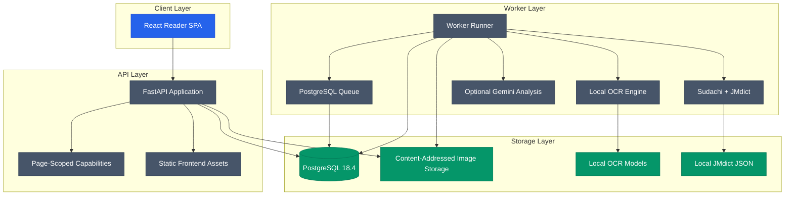

<div align="center">

# MangaSensei

**Read manga. Understand Japanese. Keep your pages local.**

A privacy-first study workspace for turning manga pages into interactive Japanese learning material with local OCR, deterministic linguistics, and optional AI explanations.

[English](README.md) · [Português](README.pt-BR.md) · [日本語](README.ja.md) · [Español](README.es.md)

</div>

[](https://github.com/Gyliardson/mangasensei/actions/workflows/ci.yml)
[](https://github.com/Gyliardson/mangasensei/releases)
[](LICENSE)
[](docs/versions.md)
[](docs/versions.md)
[](docs/versions.md)

MangaSensei extracts Japanese text from manga pages, enriches it with local linguistic data, and presents the result in a responsive reader without altering the original image. OCR model weights and JMdict-derived data stay local and are not committed or bundled into the distributable image. Gemini is optional.

Japanese content can be studied with **Brazilian Portuguese (`pt-BR`) or English (`en`) contextual explanations**. Study language is explicit and independent from the browser-local UI locale. The UI supports English (`en`) and Brazilian Portuguese (`pt-BR`), defaults to English for fresh or invalid browser state, and persists an explicit choice locally. The reviewed local JMdict meanings remain English in both study modes, and changing only the study language reuses completed OCR and Japanese linguistic analysis rather than rerunning it. See the [study-language contract](docs/study-languages.md) for the exact boundaries.

The current development version is recorded in [`VERSION`](VERSION).

## Why MangaSensei?

| Local-first | Original-first | Study-first |
| --- | --- | --- |
| OCR, models and dictionary data are local by default. | The uploaded manga image is preserved as-is and rendered separately from study overlays. | Furigana, vocabulary, study language, linguistic data and contextual explanations are organized around reading. |

## Reader Preview

<table>
  <tr>
    <td width="68%" align="center"><a href="docs/assets/reader-desktop-chromium.png"></a><br><sub>Desktop reader</sub></td>
    <td width="32%" align="center"><a href="docs/assets/reader-mobile-chromium.png"></a><br><sub>Mobile reader</sub></td>
  </tr>
</table>

## Features

| Area | Capability |
| --- | --- |
| Upload | Safe image upload with idempotency, explicit `pt-BR`/`en` study language and page-scoped HMAC capabilities |
| OCR | Local Manga Image Translator subset with checksum-verified model artifacts |
| Linguistics | Sudachi tokenization plus a normalized English-backed JMdict index generated from verified source data |
| Gemini | Optional structured `pt-BR`/`en` contextual explanations with budget tracking and `store=False` |
| Reader | React SPA with authenticated Blob rendering, responsive SVG overlays, furigana, independent `en`/`pt-BR` UI locale and study-language preferences, and vocabulary cards |
| Operations | PostgreSQL-backed queue, lease recovery, retention jobs, readiness checks and metrics |

## Architecture



## API Surface

| Method | Route | Purpose |
| --- | --- | --- |
| `POST` | `/api/v1/pages` | Upload a Japanese manga page and queue analysis with optional `studyLanguage` (`pt-BR` default or `en`) |
| `GET` | `/api/v1/pages/{page_id}` | Read page status, persisted language metadata and completed study data with a page token |
| `GET` | `/api/v1/pages/{page_id}/image` | Stream the original image through an authenticated Blob response |
| `POST` | `/api/v1/pages/{page_id}/reprocess` | Queue analysis or language-only regeneration with a reprocess capability |
| `GET` | `/health` | Process health check |
| `GET` | `/ready` | Database, storage and schema readiness check |
| `GET` | `/metrics` | Prometheus metrics |

## Local Setup

Prerequisites:

| Tool | Supported version |
| --- | --- |
| Python | `3.11.x` |
| Node.js | `24 LTS` target; `22.12+` supported for local tooling |
| Docker | `28.x` |
| uv | Required for Python dependency and lockfile management |

See [`docs/versions.md`](docs/versions.md) for the reviewed stack matrix.

Install dependencies and prepare local artifacts:

```powershell
py -3.11 -m uv sync --extra ocr
npm install
Copy-Item .env.example .env
.\.venv\Scripts\mangasensei.exe models download
.\.venv\Scripts\mangasensei.exe jmdict download
```

Generate secrets and set them in `.env` before running anything that touches the database, queue or API. Replace `POSTGRES_PASSWORD`, the password inside `MANGASENSEI_DATABASE_URL`, and the value inside `MANGASENSEI_CAPABILITY_PEPPERS` with fresh random values:

```powershell
python -c "import secrets; print(secrets.token_urlsafe(32))"
```

Gemini is optional. Leave `GOOGLE_API_KEY` unset or blank to run the worker with local OCR and linguistics only; set a non-empty key to enable contextual enrichment in the selected study language. When enabled, only OCR text and minimal region-scoped lexical candidates (`id`, `surface`, `lemma`, `reading`) are sent for optional enrichment. The original image, dictionary meanings and local JMdict dataset are not sent. With Gemini disabled, Japanese OCR/tokenization and English JMdict vocabulary remain available while contextual translation/explanation may be absent.

Run with Docker Compose:

```powershell
docker compose up --build
```

Run local quality gates:

```powershell
.\.venv\Scripts\python.exe scripts/version.py check
.\.venv\Scripts\python.exe scripts/check_markdown_links.py
.\.venv\Scripts\python.exe -m ruff check backend/src tests scripts
.\.venv\Scripts\python.exe -m mypy backend/src
.\.venv\Scripts\python.exe -m pytest --cov
npm run lint
npm run typecheck
npm run test:coverage
npm run build
npm run e2e
```

## Directory Structure

```text
backend/      Python API, worker, migrations, OCR and linguistics modules
frontend/     React SPA, reader components and Playwright tests
docs/         Version notes and visual artifacts
tests/        Backend unit and integration tests
var/          Local runtime data ignored by Git
```

## Project Activity

[](https://github.com/Gyliardson/mangasensei/graphs/contributors)
[](https://github.com/Gyliardson/mangasensei/commits/main)
[](https://github.com/Gyliardson/mangasensei/issues)
[](https://github.com/Gyliardson/mangasensei/discussions)

| Explore | Link |
| --- | --- |
| Contributors | [People building MangaSensei](https://github.com/Gyliardson/mangasensei/graphs/contributors) |
| History | [Commit history](https://github.com/Gyliardson/mangasensei/commits/main) |
| Roadmap and bugs | [Issues](https://github.com/Gyliardson/mangasensei/issues) |
| Ideas and questions | [Discussions](https://github.com/Gyliardson/mangasensei/discussions) |
| Security | [Security overview](https://github.com/Gyliardson/mangasensei/security) |
| Releases | [GitHub Releases](https://github.com/Gyliardson/mangasensei/releases) |

## Contributing

Contributions are welcome in **English, Português, 日本語 or Español**. Read the guide in your preferred language:

[English](CONTRIBUTING.md) · [Português](CONTRIBUTING.pt-BR.md) · [日本語](CONTRIBUTING.ja.md) · [Español](CONTRIBUTING.es.md)

Please also follow the [Code of Conduct](CODE_OF_CONDUCT.md). For vulnerabilities, use the private reporting path described in the [Security Policy](SECURITY.md).

## Data and Licensing

MangaSensei source code is licensed under GPL-3.0-only. JMdict-derived data is generated locally from verified third-party sources and remains subject to EDRDG / CC BY-SA terms. OCR model weights are local artifacts and are not redistributed by this repository.

See [`THIRD_PARTY_NOTICES.md`](THIRD_PARTY_NOTICES.md) for attribution, checksums and source references.

## License

Copyright (C) 2026 Gyliardson Keitison. MangaSensei is licensed under [GPL-3.0-only](LICENSE). Third-party components retain their respective notices.
