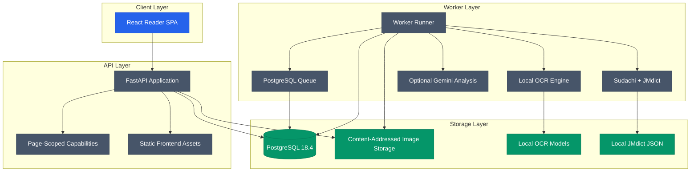

# MangaSensei

[](https://github.com/Gyliardson/mangasensei/releases)
[](LICENSE)
[](docs/versions.md)
[](docs/versions.md)
[](docs/versions.md)

MangaSensei is a privacy-conscious local study workspace that extracts Japanese
text from manga pages, enriches it with deterministic linguistic data, and
adds contextual explanations without altering the original image.

Documentation languages: [English](README.md) | [Português](README.pt-BR.md) |
[日本語](README.ja.md) | [Español](README.es.md)

The current development version is recorded in [`VERSION`](VERSION). OCR model
weights and JMdict-derived data are downloaded locally and are never committed or
included in the distributable image.

## Features

| Area | Capability |
| --- | --- |
| Upload | Safe image upload with idempotency and page-scoped HMAC capabilities |
| OCR | Local Manga Image Translator subset with checksum-verified model artifacts |
| Linguistics | Sudachi tokenization plus a normalized JMdict index generated from verified source data |
| Gemini | Optional structured study explanations with budget tracking and `store=False` |
| Reader | React SPA with authenticated Blob rendering, SVG overlays, furigana and vocabulary cards |
| Operations | PostgreSQL-backed queue, lease recovery, retention jobs, readiness checks and metrics |

## Architecture



## API Surface

| Method | Route | Purpose |
| --- | --- | --- |
| `POST` | `/api/v1/pages` | Upload a manga page and create a queued analysis job |
| `GET` | `/api/v1/pages/{page_id}` | Read page status and completed study data with a page token |
| `GET` | `/api/v1/pages/{page_id}/image` | Stream the original image through an authenticated Blob response |
| `POST` | `/api/v1/pages/{page_id}/reprocess` | Queue a new analysis run with a reprocess capability |
| `GET` | `/health` | Process health check |
| `GET` | `/ready` | Database, storage and schema readiness check |
| `GET` | `/metrics` | Prometheus metrics |

## Visual Artifacts

[](docs/assets/reader-desktop-chromium.png)

- [Desktop reader screenshot](docs/assets/reader-desktop-chromium.png)
- [Mobile reader screenshot](docs/assets/reader-mobile-chromium.png)

## Local Setup

Prerequisites:

| Tool | Version |
| --- | --- |
| Python | `3.11.x` |
| uv | `0.12.x` |
| Node.js | `22.12+` |
| Docker | `28.x` |

Install dependencies and prepare local artifacts:

```powershell
py -3.11 -m uv sync --extra ocr
npm install
Copy-Item .env.example .env
.\.venv\Scripts\mangasensei.exe models download
.\.venv\Scripts\mangasensei.exe jmdict download
```

Generate secrets and set them in `.env` before running anything that touches the database, the queue or the API: replace `POSTGRES_PASSWORD`, the password inside `MANGASENSEI_DATABASE_URL` and the value inside `MANGASENSEI_CAPABILITY_PEPPERS` with fresh random values:

```powershell
python -c "import secrets; print(secrets.token_urlsafe(32))"
```

Run with Docker Compose:

```powershell
docker compose up --build
```

Run local quality gates:

```powershell
.\.venv\Scripts\python.exe scripts/version.py check
.\.venv\Scripts\python.exe scripts/check_markdown_links.py
.\.venv\Scripts\python.exe -m ruff check backend/src tests scripts
.\.venv\Scripts\python.exe -m mypy backend/src
.\.venv\Scripts\python.exe -m pytest --cov
npm run lint
npm run typecheck
npm run test:coverage
npm run build
npm run e2e
```

## Directory Structure

```text
backend/      Python API, worker, migrations, OCR and linguistics modules
frontend/     React SPA, reader components and Playwright tests
docs/         Version notes and generated visual artifacts
tests/        Backend unit and integration tests
var/          Local runtime data ignored by Git
```

## Contributing

Contributions are welcome. Please read [`CONTRIBUTING.md`](CONTRIBUTING.md) before
opening an issue or a pull request, and follow the [`Code of Conduct`](CODE_OF_CONDUCT.md).
For security issues, use the private reporting path in [`SECURITY.md`](SECURITY.md).

## Data And Licensing

MangaSensei source code is licensed under GPL-3.0-only. JMdict-derived data is generated locally from verified third-party sources and remains subject to EDRDG / CC BY-SA terms. OCR model weights are local artifacts and are not redistributed by this repository.

See [`THIRD_PARTY_NOTICES.md`](THIRD_PARTY_NOTICES.md) for attribution, checksums and
source references.

## License

Copyright (C) 2026 Gyliardson Keitison. MangaSensei is licensed under GPL-3.0-only. Third-party components retain their respective notices.
