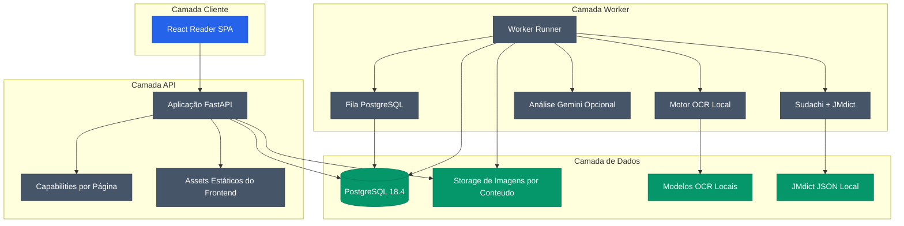

<div align="center">

# MangaSensei

**Leia mangá. Entenda japonês. Mantenha suas páginas locais.**

Um ambiente de estudo focado em privacidade para transformar páginas de mangá em material interativo de japonês com OCR local, linguística determinística e explicações opcionais por IA.

[English](README.md) · [Português](README.pt-BR.md) · [日本語](README.ja.md) · [Español](README.es.md)

</div>

[](https://github.com/Gyliardson/mangasensei/actions/workflows/ci.yml)
[](https://github.com/Gyliardson/mangasensei/releases)
[](LICENSE)
[](docs/versions.md)
[](docs/versions.md)
[](docs/versions.md)

O MangaSensei extrai texto japonês de páginas de mangá, enriquece o resultado com dados linguísticos locais e apresenta tudo em um leitor responsivo sem alterar a imagem original. Os pesos dos modelos de OCR e os dados derivados do JMdict permanecem locais e não são commitados nem incluídos na imagem distribuível. Gemini é opcional.

Conteúdo japonês pode ser estudado com **explicações contextuais em Português (Brasil) (`pt-BR`) ou Inglês (`en`)**. O idioma de estudo é explícito e independente do locale atual da interface, que continua em português. Os significados determinísticos do JMdict local permanecem em inglês nos dois modos, e trocar apenas o idioma de estudo reaproveita OCR e análise linguística japonesa já concluídos. Consulte o [contrato de idiomas de estudo](docs/study-languages.md) para os limites exatos.

A versão atual de desenvolvimento está registrada em [`VERSION`](VERSION).

## Por que MangaSensei?

| Local-first | Imagem original preservada | Feito para estudar |
| --- | --- | --- |
| OCR, modelos e dados de dicionário são locais por padrão. | A página enviada permanece intacta; as informações de estudo são renderizadas separadamente. | Furigana, vocabulário, idioma de estudo, dados linguísticos e explicações contextuais são organizados em torno da leitura. |

## Prévia do Leitor

<table>
  <tr>
    <td width="68%" align="center"><a href="docs/assets/reader-desktop-chromium.png"></a><br><sub>Leitor desktop</sub></td>
    <td width="32%" align="center"><a href="docs/assets/reader-mobile-chromium.png"></a><br><sub>Leitor mobile</sub></td>
  </tr>
</table>

## Recursos

| Área | Capacidade |
| --- | --- |
| Upload | Envio seguro de imagem com idempotência, idioma de estudo explícito `pt-BR`/`en` e capabilities HMAC por página |
| OCR | Subconjunto local do Manga Image Translator com modelos verificados por checksum |
| Linguística | Tokenização Sudachi e índice JMdict normalizado em inglês gerado a partir de fonte verificada |
| Gemini | Explicações contextuais estruturadas opcionais em `pt-BR`/`en`, com controle de orçamento e `store=False` |
| Leitor | SPA React com Blob autenticado, overlays SVG responsivos, furigana, preferência de idioma de estudo e cartões de vocabulário |
| Operação | Fila PostgreSQL, recuperação por leases, retenção, readiness e métricas |

## Arquitetura



## Superfície da API

| Método | Rota | Função |
| --- | --- | --- |
| `POST` | `/api/v1/pages` | Envia uma página de mangá japonês e cria análise com `studyLanguage` opcional (`pt-BR` padrão ou `en`) |
| `GET` | `/api/v1/pages/{page_id}` | Consulta status, metadados persistidos de idioma e dados de estudo concluídos usando o token da página |
| `GET` | `/api/v1/pages/{page_id}/image` | Retorna a imagem original por uma resposta Blob autenticada |
| `POST` | `/api/v1/pages/{page_id}/reprocess` | Coloca análise ou regeneração apenas do idioma de estudo na fila usando uma capability de reprocessamento |
| `GET` | `/health` | Health check do processo |
| `GET` | `/ready` | Verificação de banco, storage e schema |
| `GET` | `/metrics` | Métricas Prometheus |

## Execução Local

Pré-requisitos:

| Ferramenta | Versão suportada |
| --- | --- |
| Python | `3.11.x` |
| Node.js | alvo `24 LTS`; `22.12+` suportado para tooling local |
| Docker | `28.x` |
| uv | Necessário para dependências Python e gerenciamento do lockfile |

Veja [`docs/versions.md`](docs/versions.md) para a matriz revisada da stack.

Instale as dependências e prepare os artefatos locais:

```powershell
py -3.11 -m uv sync --extra ocr
npm install
Copy-Item .env.example .env
.\.venv\Scripts\mangasensei.exe models download
.\.venv\Scripts\mangasensei.exe jmdict download
```

Gere segredos e configure-os no `.env` antes de executar qualquer coisa que use banco de dados, fila ou API. Substitua `POSTGRES_PASSWORD`, a senha dentro de `MANGASENSEI_DATABASE_URL` e o valor dentro de `MANGASENSEI_CAPABILITY_PEPPERS` por valores aleatórios novos:

```powershell
python -c "import secrets; print(secrets.token_urlsafe(32))"
```

Gemini é opcional. Deixe `GOOGLE_API_KEY` ausente ou em branco para executar o worker somente com OCR e linguística locais; configure uma chave não vazia para habilitar enriquecimento contextual no idioma de estudo selecionado. Quando habilitado, somente o texto do OCR e candidatos lexicais mínimos por região (`id`, `surface`, `lemma`, `reading`) são enviados para o enriquecimento opcional. A imagem original, os significados do dicionário e o dataset JMdict local não são enviados. Com Gemini desabilitado, OCR/tokenização japoneses e vocabulário JMdict em inglês continuam disponíveis; tradução e explicação contextuais podem ficar ausentes.

Execute com Docker Compose:

```powershell
docker compose up --build
```

Execute os quality gates locais:

```powershell
.\.venv\Scripts\python.exe scripts/version.py check
.\.venv\Scripts\python.exe scripts/check_markdown_links.py
.\.venv\Scripts\python.exe -m ruff check backend/src tests scripts
.\.venv\Scripts\python.exe -m mypy backend/src
.\.venv\Scripts\python.exe -m pytest --cov
npm run lint
npm run typecheck
npm run test:coverage
npm run build
npm run e2e
```

## Estrutura do Repositório

```text
backend/      API Python, worker, migrations, OCR e linguística
frontend/     SPA React, componentes do leitor e testes Playwright
docs/         Notas de versão e artefatos visuais
tests/        Testes unitários e de integração do backend
var/          Dados locais de runtime ignorados pelo Git
```

## Atividade do Projeto

[](https://github.com/Gyliardson/mangasensei/graphs/contributors)
[](https://github.com/Gyliardson/mangasensei/commits/main)
[](https://github.com/Gyliardson/mangasensei/issues)
[](https://github.com/Gyliardson/mangasensei/discussions)

| Explore | Link |
| --- | --- |
| Contribuidores | [Quem está construindo o MangaSensei](https://github.com/Gyliardson/mangasensei/graphs/contributors) |
| Histórico | [Histórico de commits](https://github.com/Gyliardson/mangasensei/commits/main) |
| Roadmap e bugs | [Issues](https://github.com/Gyliardson/mangasensei/issues) |
| Ideias e perguntas | [Discussions](https://github.com/Gyliardson/mangasensei/discussions) |
| Segurança | [Visão de segurança](https://github.com/Gyliardson/mangasensei/security) |
| Releases | [GitHub Releases](https://github.com/Gyliardson/mangasensei/releases) |

## Contribuição

Contribuições são bem-vindas em **English, Português, 日本語 ou Español**. Leia o guia no idioma de sua preferência:

[English](CONTRIBUTING.md) · [Português](CONTRIBUTING.pt-BR.md) · [日本語](CONTRIBUTING.ja.md) · [Español](CONTRIBUTING.es.md)

Siga também o [Código de Conduta](CODE_OF_CONDUCT.pt-BR.md). Para vulnerabilidades, use o canal privado descrito na [Política de Segurança](SECURITY.pt-BR.md).

## Dados e Licenciamento

O código-fonte do MangaSensei usa GPL-3.0-only. Dados derivados do JMdict são gerados localmente a partir de fontes de terceiros verificadas e permanecem sujeitos aos termos EDRDG / CC BY-SA. Pesos dos modelos de OCR são artefatos locais e não são redistribuídos por este repositório.

Veja [`THIRD_PARTY_NOTICES.md`](THIRD_PARTY_NOTICES.md) para atribuições, checksums e referências de origem.

## Licença

Copyright (C) 2026 Gyliardson Keitison. MangaSensei é licenciado sob [GPL-3.0-only](LICENSE). Componentes de terceiros mantêm seus respectivos avisos.
