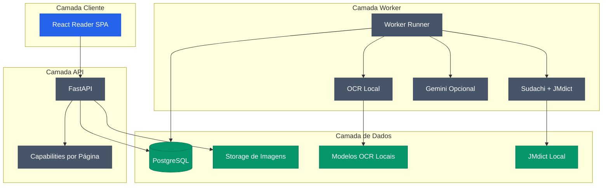

# MangaSensei

[](CHANGELOG.md)
[](LICENSE)
[](docs/versions.md)
[](docs/versions.md)

O MangaSensei é um ambiente local de estudo que extrai texto japonês de páginas
de mangá, adiciona dados linguísticos determinísticos e produz explicações
contextuais sem alterar a imagem original.

Documentação: [English](README.md) | [Português](README.pt-BR.md) |
[日本語](README.ja.md) | [Español](README.es.md)

> A versão 0.1.0 é um MVP local. Os pesos de OCR e os dados derivados do JMdict são baixados localmente e não fazem parte do Git nem da imagem distribuível.

## Recursos

| Área | Capacidade |
| --- | --- |
| Upload | Envio seguro de imagem com idempotência e capabilities HMAC por página |
| OCR | Subconjunto local do Manga Image Translator com modelos verificados por checksum |
| Linguística | Sudachi e JMdict normalizado gerado a partir de fonte verificada |
| Gemini | Explicações estruturadas opcionais com orçamento e `store=False` |
| Leitor | SPA React com Blob autenticado, SVG responsivo, furigana e vocabulário |
| Operação | Fila PostgreSQL, leases, retenção, readiness e métricas |

## Arquitetura



## Execução Local

```powershell
py -3.11 -m uv sync --extra ocr
npm install
Copy-Item .env.example .env
.\.venv\Scripts\mangasensei.exe models download
.\.venv\Scripts\mangasensei.exe jmdict download
docker compose up --build
```

Gere segredos e configure-os no `.env` antes de executar qualquer coisa que use banco de dados, fila ou API: substitua `POSTGRES_PASSWORD`, a senha dentro de `MANGASENSEI_DATABASE_URL` e o valor dentro de `MANGASENSEI_CAPABILITY_PEPPERS`:

```powershell
python -c "import secrets; print(secrets.token_urlsafe(32))"
```

## Rotas Principais

| Método | Rota | Função |
| --- | --- | --- |
| `POST` | `/api/v1/pages` | Envia uma página e cria um job |
| `GET` | `/api/v1/pages/{page_id}` | Consulta o resultado com token de página |
| `GET` | `/api/v1/pages/{page_id}/image` | Retorna a imagem original autenticada |
| `POST` | `/api/v1/pages/{page_id}/reprocess` | Reprocessa a página com capability dedicada |

## Artefatos Visuais

| Tela | Caminho |
| --- | --- |
| Leitor desktop | `docs/assets/reader-desktop-chromium.png` |
| Leitor mobile | `docs/assets/reader-mobile-chromium.png` |

## Estrutura

```text
backend/      API Python, worker, migrations, OCR e linguística
frontend/     SPA React e testes Playwright
docs/         Versões e capturas visuais
tests/        Testes unitários e de integração do backend
var/          Dados locais ignorados pelo Git
```

## Contribuição

Contribuições são bem-vindas. Leia [`CONTRIBUTING.md`](CONTRIBUTING.md) antes de abrir
uma issue ou um pull request e siga o [`Código de Conduta`](CODE_OF_CONDUCT.md). Para
problemas de segurança, use o canal privado descrito em [`SECURITY.md`](SECURITY.md).

## Licença

Copyright (C) 2026 Gyliardson Keitison. O código do MangaSensei usa GPL-3.0-only. Dados JMdict e componentes de terceiros mantêm suas próprias licenças e avisos em `THIRD_PARTY_NOTICES.md`.
