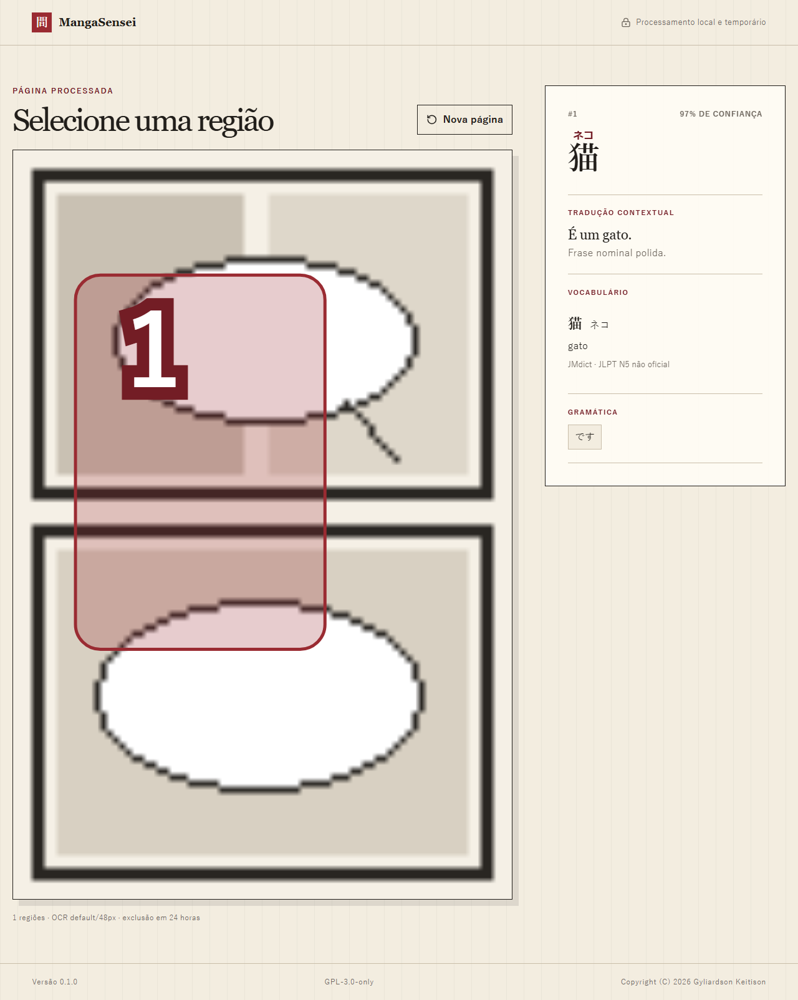
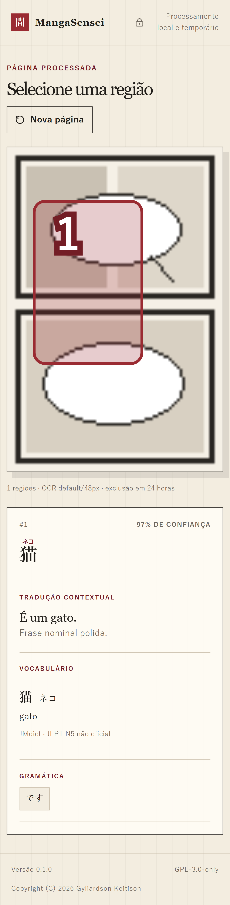
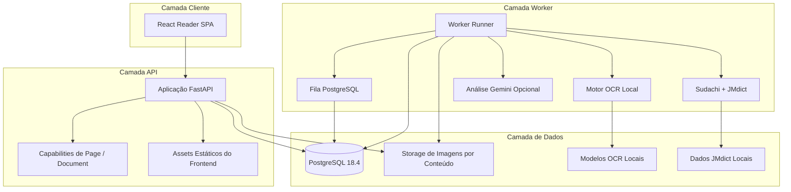

<div align="center">

# MangaSensei

**Leia mangá. Entenda japonês. Mantenha suas páginas locais.**

Um ambiente local-first para estudar japonês com mangá, usando OCR, linguística determinística, ferramentas interativas de leitura e explicações opcionais por IA.

**Status: pré-release / desenvolvimento ativo.** O MangaSensei já pode ser executado a partir do código-fonte, mas ainda não existe uma Release pública estável no GitHub.

[English](README.md) · [Português](README.pt-BR.md) · [日本語](README.ja.md) · [Español](README.es.md)

[](https://github.com/Gyliardson/mangasensei/actions/workflows/ci.yml)
[](LICENSE)

</div>

<p align="center">
  <a href="docs/assets/reader-desktop-chromium.png"></a>
  <br>
  <sub>Prévia atual do leitor de uma página. Mídia reproduzível e apresentação multipágina dedicadas fazem parte de um workstream posterior.</sub>
</p>

O MangaSensei preserva a página original e renderiza as informações de estudo separadamente. OCR, tokenização Sudachi e dados revisados do dicionário JMdict rodam localmente na sua instalação do MangaSensei. O enriquecimento por Gemini é opcional e pode permanecer totalmente desabilitado.

## Por que MangaSensei?

| Local-first | Imagem original preservada | Feito para estudar |
| --- | --- | --- |
| OCR e análise linguística fundamentais não dependem de um serviço de IA em nuvem. | As imagens enviadas permanecem inalteradas; regiões de OCR e dados de estudo são separados. | Furigana, vocabulário, preferências de idioma, zoom/ajuste e contexto de estudo são organizados em torno da leitura. |

## Quick Start com Docker Compose

Este é o caminho mais curto suportado para visitantes. Ele **não** exige Python, Node.js ou `uv` instalados no host; essas ferramentas são requisitos de desenvolvimento, não do Quick Start via Docker.

### 1. Clone e crie a configuração local

Requisitos: Git, Docker e Docker Compose v2.

```sh
git clone https://github.com/Gyliardson/mangasensei.git
cd mangasensei
cp .env.example .env
```

No PowerShell:

```powershell
Copy-Item .env.example .env
```

Gere dois valores aleatórios independentes. O comando abaixo usa a mesma imagem-base Python fixada por checksum atualmente usada pelo MangaSensei, então Docker é o único requisito de runtime para esta etapa:

```sh
docker run --rm python:3.11-slim-bookworm@sha256:d29f48a31a8b408ed19272ca1e7b10ebae13b240a27e862d3d4217c528e2e0c3 python -c "import secrets; print(secrets.token_urlsafe(32))"
```

Execute o comando duas vezes e edite `.env`:

- substitua `POSTGRES_PASSWORD` pelo primeiro valor;
- substitua o valor dentro de `MANGASENSEI_CAPABILITY_PEPPERS=["..."]` pelo segundo;
- deixe `GOOGLE_API_KEY=` vazio para usar somente OCR e linguística locais.

`MANGASENSEI_DATABASE_URL` em `.env.example` serve para desenvolvimento executado diretamente no host. O Docker Compose fornece sua própria URL de banco interna aos containers, então esse campo não precisa ser alterado para este Quick Start.

Nunca reutilize os placeholders do repositório nem faça commit do seu `.env`.

### 2. Construa e inicie o MangaSensei

```sh
docker compose up --detach --build
```

Em uma instalação limpa, esse comando constrói a aplicação e executa serviços one-shot para migrations, modelos de OCR fixados por checksum e os dados JMdict revisados em inglês antes de o worker ficar pronto. **O primeiro bootstrap exige acesso à rede** para obter camadas de containers, artefatos de modelos OCR e dados-fonte do JMdict. Depois disso, esses artefatos ficam em volumes Docker locais para o processamento local subsequente.

Gemini permanece desabilitado quando `GOOGLE_API_KEY` está vazio. OCR japonês, análise Sudachi e vocabulário determinístico do JMdict continuam funcionando; campos de tradução/explicação contextual por IA podem ficar ausentes.

### 3. Verifique readiness e abra o leitor

```sh
docker compose ps --all
curl --fail http://127.0.0.1:8000/ready
```

No PowerShell:

```powershell
Invoke-RestMethod http://127.0.0.1:8000/ready
```

Depois abra **http://127.0.0.1:8000** e analise uma página JPEG, PNG ou WebP. Também é possível selecionar várias imagens suportadas para criar um Document temporário e ordenado.

Se o bootstrap falhar, consulte os logs relevantes:

```sh
docker compose logs models jmdict migrate api worker
```

### 4. Pare ou limpe o ambiente

Para containers mantendo volumes locais de banco/modelos/dicionário:

```sh
docker compose down
```

Para remover também os volumes Docker locais do MangaSensei:

```sh
docker compose down --volumes --remove-orphans
```

O segundo comando remove estado local do banco, storage de páginas enviadas, modelos OCR e dados JMdict; os downloads de bootstrap serão necessários novamente no próximo início limpo.

## Fluxo principal

Uma sessão normal de leitura é intencionalmente simples:

1. Selecione uma imagem suportada ou um conjunto ordenado de imagens.
2. O MangaSensei preserva a imagem original e enfileira cada Page para OCR local e análise linguística.
3. Abra Pages concluídas no leitor responsivo enquanto os overlays de estudo permanecem separados da imagem-fonte.
4. Selecione regiões de OCR para inspecionar texto japonês, furigana, tokens e vocabulário determinístico do dicionário.
5. Opcionalmente habilite Gemini para enriquecimento contextual no idioma de estudo.

O leitor atual também é responsivo em telas móveis:

<p align="center">
  <a href="docs/assets/reader-mobile-chromium.png"></a>
  <br>
  <sub>Prévia atual do leitor mobile.</sub>
</p>

## Fluxo multipágina

Os Slices B e C de [#105](https://github.com/Gyliardson/mangasensei/issues/105) suportam Documents de múltiplas imagens ordenadas, resultados parciais e controles de recuperação sem transformar um volume inteiro em um único job de OCR.

**Disponível agora:**

- selecionar várias imagens JPEG, PNG ou WebP e inspecionar/reordenar antes do upload;
- preservar a ordem exibida antes do envio como ordem inicial canônica do Document;
- manter cada Page como unidade independente de OCR/estudo/job;
- mostrar estados agregados verdadeiros de processando, concluído, concluído com erros e cancelado, com contagens de Pages concluídas / processando / com falha / canceladas;
- manter Pages concluídas legíveis enquanto trabalho irmão ou posterior ainda processa, falha ou é cancelado;
- repetir Pages com falha e sem resultado legível por uma operação de Document limitada/idempotente, sem recomputar Pages irmãs bem-sucedidas;
- cancelar cooperativamente o processamento ativo do Document sem reescrever Pages já concluídas;
- persistir a ordem das Pages após a criação com concorrência otimista;
- navegar por seleção direta e pelos controles Anterior / Próxima;
- reprocessar o idioma de estudo somente na Page atual pelo leitor; a API protegida mantém um caminho de reprojeção de dicionário somente em inglês;
- manter Document e todas as Pages filhas no mesmo limite exato de retenção de 24 horas.

**Ainda adiado em #105:** importação de PDF endurecida, thumbnails, biblioteca persistente de mangá, semântica de ordem de leitura em spreads/entre páginas e hardening posterior de performance/escala para Documents grandes.

Consulte o [contrato de Documents multi-imagem](docs/document-imports.md) para limites, capabilities, idempotência, retenção, recuperação e semântica de falhas.

## Validação atual

### Evidência de OCR e qualidade do produto

O MangaSensei **não** publica atualmente uma porcentagem universal de acurácia de OCR. Contagem de testes de CI e cobertura de código são garantias de engenharia, não métricas de acurácia de OCR.

A evidência atual de OCR inclui:

- regressões sintéticas determinísticas e um smoke de compatibilidade com modelos reais em CPU;
- um **corpus de pressão de 12 páginas de mangá real licenciado**, verificado por checksum e com proveniência/regras de uso documentadas;
- âncoras revisadas em páginas reais para recall de texto vertical curto, regressões de contexto/reconhecedor e um guard específico de precisão contra textura gráfica;
- um estudo controlado de compatibilidade OpenCV 4→5 no corpus revisado que encontrou drift limitado de pixels no warp do reconhecedor sem mudança no texto aceito/final, geometria final, ordem de leitura ou casos de pressão revisados.

O corpus de 12 páginas deliberadamente **não** possui ground truth exaustivo de transcrição para todas as páginas. As páginas mais amplas usam contratos de regressão/caracterização em vez de uma verdade completa inventada; por isso o MangaSensei não deriva desse dataset CER global, precision/recall de detecção ou afirmações como "99% de acurácia".

Limitações conhecidas continuam rastreadas, incluindo geometria de bōten/marcas de ênfase destacadas ([#93](https://github.com/Gyliardson/mangasensei/issues/93)), substituições de glifos semelhantes com alta confiança ([#99](https://github.com/Gyliardson/mangasensei/issues/99)) e uma classe de falso positivo gráfico/símbolo com alta confiança ([#100](https://github.com/Gyliardson/mangasensei/issues/100)).

Veja a [estratégia de testes](docs/testing.md) e o [contrato do corpus licenciado](tests/fixtures/ocr/real_manga/black_jack/README.md) para os limites exatos dessas garantias.

### Garantia de engenharia

O CI normal valida separadamente lint/tipos/testes do backend com cobertura, lint/typecheck/testes unitários/cobertura/build do frontend, Playwright mockado para desktop/mobile/acessibilidade, um fluxo full-stack real browser → FastAPI → PostgreSQL com as fronteiras externas de OCR/Gemini substituídas deterministicamente, build/runtime Docker de produção, wheel/sdist com clean install e verificações de segurança de segredos/dependências. CodeQL roda separadamente, e o workflow de contrato do JMdict verifica integridade source→runtime do dicionário mais bootstrap/readiness do Compose em estado limpo.

Esses gates estão descritos em [docs/testing.md](docs/testing.md) e implementados em [`.github/workflows/`](.github/workflows/).

## Privacidade e fronteiras local-first

- As imagens originais de mangá permanecem dentro da sua instalação do MangaSensei e nunca são enviadas ao Gemini.
- OCR roda localmente com artefatos de modelo verificados por checksum.
- Tokenização Sudachi e dados revisados do JMdict são locais.
- Gemini é opcional. Quando habilitado, o contrato atual envia texto de OCR e candidatos lexicais mínimos por região (`id`, `surface`, `lemma`, `reading`) para enriquecimento contextual; não envia a imagem original, o dataset JMdict nem significados determinísticos do dicionário, e as requisições usam `store=False`.
- Acesso a Pages e Documents usa capability tokens com escopo em vez de tratar um UUID de recurso como autorização.
- Dados de Page/Document seguem o contrato atual de retenção exata de 24 horas; leitura ou reprojeção de idioma não estende esse prazo.

"Local-first" descreve as fronteiras de processamento e dados depois que os artefatos necessários estão disponíveis. Um bootstrap Docker novo ainda pode precisar de rede para baixar modelos fixados, fontes do dicionário e camadas de containers; Gemini opcional naturalmente exige acesso ao provedor quando habilitado.

Consulte [SECURITY.pt-BR.md](SECURITY.pt-BR.md), [docs/document-imports.md](docs/document-imports.md) e [docs/testing.md](docs/testing.md) para contratos mais profundos.

## Idiomas e recursos de estudo

Quatro eixos permanecem conceitualmente distintos, embora o dicionário local determinístico agora seja somente em inglês:

| Eixo | Suporte atual |
| --- | --- |
| Conteúdo do mangá | Japonês (`ja`) |
| Estudo / explicação contextual | Português (Brasil) (`pt-BR`) ou Inglês (`en`) |
| Dicionário local determinístico | somente Inglês (`en`) |
| Locale da interface | Inglês (`en`) ou Português (Brasil) (`pt-BR`) |

O leitor não expõe mais seletor de idioma do dicionário. Novas solicitações de reprojeção de dicionário aceitam somente inglês; valores não suportados como `de` ou `pt-BR` são rejeitados, e não convertidos silenciosamente para inglês. Resultados históricos ainda não expirados podem manter metadados antigos de idioma solicitado/efetivo/fallback, que continuam legíveis sem baixar o pack alemão aposentado. As opções de idioma de estudo e da interface não mudaram.

Veja o [contrato dos eixos de idioma](docs/study-languages.md) e o [contrato dos dados JMdict](docs/jmdict-packs.md).

## Recursos

| Área | Capacidade |
| --- | --- |
| Upload | Upload seguro standalone mais Documents multi-imagem ordenados/limitados, com idempotência e capabilities com escopo |
| OCR | Subconjunto local do Manga Image Translator com modelos verificados por checksum |
| Linguística | Tokenização Sudachi e dados JMdict locais revisados em inglês sobre identidades lexicais canônicas independentes de idioma |
| Leitor | Renderização Blob autenticada da imagem original, overlays SVG responsivos, furigana, zoom/ajuste, navegação multipágina e leitura de resultados parciais |
| Idiomas | Preferências independentes de UI e estudo/explicação, com significados locais determinísticos em inglês |
| Gemini | Explicações contextuais estruturadas opcionais em `pt-BR`/`en`, controle de orçamento, contexto textual mínimo e `store=False` |
| Operação | Fila PostgreSQL, recuperação por leases, retenção limitada, readiness, métricas e runtime Compose endurecido |

## Limitações conhecidas e escopo pré-release

O MangaSensei ainda é software pré-release. Além das limitações de OCR listadas em [Validação atual](#validação-atual):

- importação de PDF ainda não existe;
- Documents são temporários, não uma biblioteca persistente de mangá;
- thumbnails e ordem de leitura aware de spreads/entre páginas não estão implementados;
- hardening posterior de performance/escala para Documents grandes continua adiado em #105;
- capability tokens de Document ficam apenas na sessão ativa da página do navegador, então um reload perde o acesso em vez de persistir um token sensível de forma insegura;
- saída contextual do Gemini é enriquecimento opcional e não é necessária para estudo local com OCR/JMdict.

A versão atual de desenvolvimento está registrada em [`VERSION`](VERSION). Acompanhe [issues](https://github.com/Gyliardson/mangasensei/issues) para roadmap e defeitos conhecidos.

## Arquitetura



O stack Compose de produção executa PostgreSQL, serviços one-shot de bootstrap de modelos/JMdict/migrations, o serviço FastAPI/frontend, worker e retenção com capabilities Linux removidas, `no-new-privileges`, execução não-root da aplicação e filesystem da aplicação somente leitura onde aplicável.

## Qualidade de engenharia e desenvolvimento

### Toolchain de desenvolvimento

O Quick Start Docker acima é o caminho para visitantes. Desenvolvimento direto no host usa adicionalmente as versões revisadas em [docs/versions.md](docs/versions.md), incluindo Python 3.11, Node.js 24 LTS como alvo (`22.12+` suportado pelo tooling atual) e `uv`.

Comandos típicos de dependências/bootstrap:

```sh
uv sync --extra ocr
npm install
uv run mangasensei models download
uv run mangasensei models verify
uv run mangasensei jmdict download
```

Para execução direta no host, crie `.env` a partir de `.env.example` e siga seus comentários para que a URL do banco no host use a mesma senha gerada. Docker Compose continua sendo o caminho suportado mais simples para executar o stack completo.

<details>
<summary>Quality gates locais</summary>

```sh
uv run python scripts/version.py check
uv run python scripts/check_markdown_links.py
uv run ruff check backend/src tests scripts
uv run mypy backend/src
uv run pytest --cov
npm run lint
npm run typecheck
npm run test:coverage
npm run build
npm run e2e
```

Garantias mais pesadas de OCR, Compose limpo, CodeQL e release/distribuição estão documentadas em [docs/testing.md](docs/testing.md).

</details>

### Contribuição e atividade do projeto

Contribuições são bem-vindas em **English, Português, 日本語 ou Español**.

[Guia de contribuição](CONTRIBUTING.pt-BR.md) · [Código de Conduta](CODE_OF_CONDUCT.pt-BR.md) · [Política de Segurança](SECURITY.pt-BR.md) · [Issues](https://github.com/Gyliardson/mangasensei/issues) · [Discussions](https://github.com/Gyliardson/mangasensei/discussions) · [Contribuidores](https://github.com/Gyliardson/mangasensei/graphs/contributors)

## API e documentação detalhada

O FastAPI serve documentação interativa da API em `/api/docs` quando o MangaSensei está rodando. Os recursos Page/Document continuam protegidos por capabilities.

<details>
<summary>Superfície principal da API</summary>

| Método | Rota | Função |
| --- | --- | --- |
| `POST` | `/api/v1/pages` | Envia uma página japonesa e enfileira análise |
| `GET` | `/api/v1/pages/{page_id}` | Consulta uma Page standalone com sua capability de leitura |
| `GET` | `/api/v1/pages/{page_id}/image` | Retorna a imagem original standalone protegida |
| `POST` | `/api/v1/pages/{page_id}/reprocess` | Reprocessa um eixo de idioma standalone suportado |
| `POST` | `/api/v1/documents` | Cria um Document multi-imagem ordenado |
| `GET` | `/api/v1/documents/{document_id}` | Consulta filhos ordenados, status agregado e progresso |
| `GET` | `/api/v1/documents/{document_id}/progress` | Consulta contagens concluídas/processando/com falha/canceladas |
| `GET` | `/api/v1/documents/{document_id}/pages/{page_id}` | Consulta uma StudyPage membro |
| `GET` | `/api/v1/documents/{document_id}/pages/{page_id}/image` | Retorna a imagem original protegida de um membro |
| `POST` | `/api/v1/documents/{document_id}/pages/{page_id}/reprocess` | Reprocessa um eixo de idioma suportado em uma Page membro |
| `POST` | `/api/v1/documents/{document_id}/retry-failed` | Repete de forma idempotente Pages membro elegíveis com falha e sem resultado legível |
| `POST` | `/api/v1/documents/{document_id}/cancel` | Solicita cancelamento cooperativo do trabalho ativo do Document |
| `PUT` | `/api/v1/documents/{document_id}/order` | Persiste a ordem completa dos membros com concorrência otimista |
| `GET` | `/health` | Health do processo |
| `GET` | `/ready` | Readiness de banco, storage e schema |
| `GET` | `/metrics` | Métricas Prometheus |

</details>

Documentação útil:

- [Imports de Document multi-imagem](docs/document-imports.md)
- [Contrato de estudo e eixos de idioma](docs/study-languages.md)
- [Dados JMdict revisados](docs/jmdict-packs.md)
- [Estratégia de testes](docs/testing.md)
- [Versões revisadas da stack](docs/versions.md)
- [Política de Segurança](SECURITY.pt-BR.md)
- [Avisos de terceiros](THIRD_PARTY_NOTICES.md)

## Dados e licenciamento

O código-fonte do MangaSensei usa GPL-3.0-only. Dados derivados do JMdict são gerados localmente a partir de fontes de terceiros verificadas por checksum e permanecem sujeitos aos termos EDRDG / CC BY-SA. Pesos de modelos OCR são artefatos locais e não são redistribuídos por este repositório.

As fixtures licenciadas de mangá real usadas nos testes de pressão de OCR possuem termos próprios do detentor dos direitos e **não** são cobertas pela licença GPL do MangaSensei; a presença delas como fixtures de teste não deve ser interpretada como uma licença geral para demo/mídia pública. Consulte o [contrato das fixtures](tests/fixtures/ocr/real_manga/black_jack/README.md).

Veja [`THIRD_PARTY_NOTICES.md`](THIRD_PARTY_NOTICES.md) para atribuições, referências de integridade e detalhes das fontes.

## Licença

Copyright (C) 2026 Gyliardson Keitison. MangaSensei é licenciado sob [GPL-3.0-only](LICENSE). Componentes e dados de terceiros mantêm seus respectivos avisos e termos.